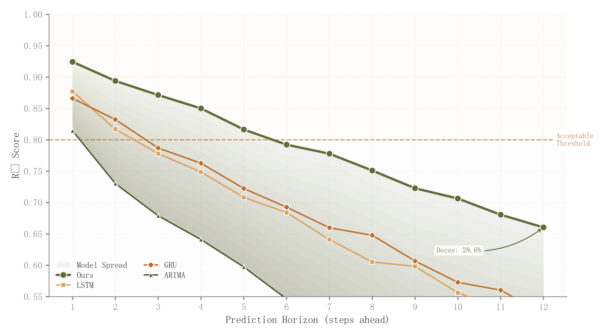

# 062 · 预测步长性能与模型跨度

ID：`empirical.multistep_decay`

用途：预测越远性能怎样下降，模型差距如何变化？

标签：预测、趋势、比较

别名：预测步长性能与模型跨度

## 数据要求

- 各模型按预测步长排列的指标

## 组合结构

多模型折线；模型间跨度填充

## 视觉特点

- 接受阈值
- 末端衰减标注
- 主模型突出

## 适配注意

填充表达模型之间的范围，不是置信区间；指标需同方向同量纲。

## 预览

## 来源与核对

原名称：Multi-Step Prediction Decay
原始代码：[查看](../sources/empirical.multistep_decay/original.html)
预览范围：首个主要Python示例
已查看对应预览并核对主要绘图和数据代码；卡片不是统计有效性认证。

## 相近候选

- [多步预测性能衰减](competition.multistep_decay.md)

<!-- fidelity:start -->
## 源码保真要点

以当前完整配方源码为底稿；下列行号指向解释预览的快照。数据适配不应顺手删掉这些视觉结构。

### 模型间跨度的叠层填充

- 保留重点：保留最差到最好模型间的多层跨度填充和主次折线、阈值参考；跨度不是每模型置信区间。
- 可适配：步数、方法、真实跨度和接受阈值可变，末端衰减标注重算。
- 源码：[L19–20](../sources/empirical.multistep_decay/original.html#L19) · [L21–21](../sources/empirical.multistep_decay/original.html#L21) · [L24–24](../sources/empirical.multistep_decay/original.html#L24) · [L33–34](../sources/empirical.multistep_decay/original.html#L33)

按现有审图流程对照实际输出；有疑问时可用[源码差异提示](../../template-fidelity.md)。
