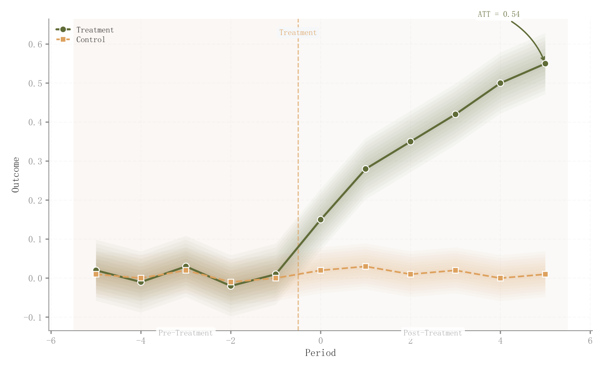

# 048 · 处理组与对照组趋势

ID：`empirical.parallel_trends`

用途：干预前后两组路径是否分离？

标签：因果、趋势、误差

别名：DID、parallel trends、平行趋势

## 数据要求

- 相对时期
- 两组均值或估计轨迹及标准误

## 组合结构

双序列；干预前后背景区

## 视觉特点

- 八层透明区间
- 实虚线区分
- 干预分界与末端差值箭头

## 适配注意

末端差值注释ATT并非正式DID估计；视觉近似平行不替代识别假设检验。

## 预览

## 来源与核对

原名称：Parallel Trends (DID)
原始代码：[查看](../sources/empirical.parallel_trends/original.html)
预览范围：首个主要Python示例
已查看对应预览并核对主要绘图和数据代码；卡片不是统计有效性认证。

<!-- fidelity:start -->
## 源码保真要点

以当前完整配方源码为底稿；下列行号指向解释预览的快照。数据适配不应顺手删掉这些视觉结构。

### 多层区间与干预分区

- 保留重点：保留八层透明区间、处理/对照实虚线与白边点、干预前后分区和末端差值箭头。
- 可适配：时期、干预时点、均值与标准误重新计算，区间内缩保持嵌套，不凭图宣称平行趋势成立。
- 源码：[L15–15](../sources/empirical.parallel_trends/original.html#L15) · [L30–31](../sources/empirical.parallel_trends/original.html#L30) · [L32–33](../sources/empirical.parallel_trends/original.html#L32) · [L35–36](../sources/empirical.parallel_trends/original.html#L35) · [L37–38](../sources/empirical.parallel_trends/original.html#L37) · [L40–47](../sources/empirical.parallel_trends/original.html#L40)

按现有审图流程对照实际输出；有疑问时可用[源码差异提示](../../template-fidelity.md)。
