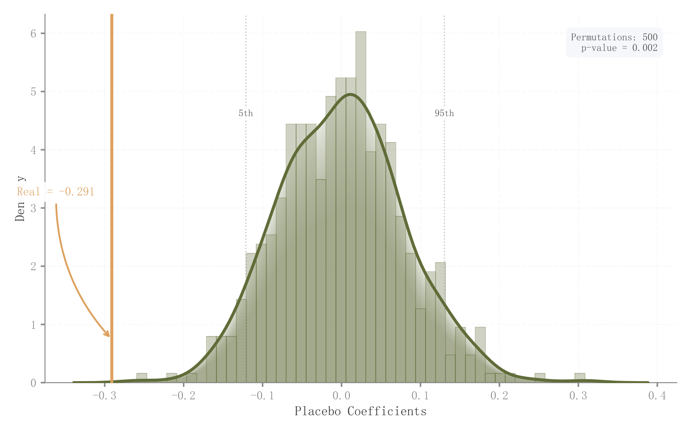

# 050 · 安慰剂系数分布与真实效应

ID：`empirical.placebo`

用途：真实估计相对随机置换结果是否异常？

标签：因果、分布、诊断

别名：安慰剂系数分布与真实效应

## 数据要求

- 置换或安慰剂估计样本
- 真实估计值

## 组合结构

直方图叠加KDE；真实值竖线

## 视觉特点

- 多层透明密度填充
- 分位参考线
- 尾部箭头

## 适配注意

示例仅模拟正态系数，未执行置换回归；p值应按实际置换方案和有限次数口径计算。

## 预览

## 来源与核对

原名称：Placebo Test
原始代码：[查看](../sources/empirical.placebo/original.html)
预览范围：首个主要Python示例
已查看对应预览并核对主要绘图和数据代码；卡片不是统计有效性认证。

<!-- fidelity:start -->
## 源码保真要点

以当前完整配方源码为底稿；下列行号指向解释预览的快照。数据适配不应顺手删掉这些视觉结构。

### 透明密度叠层与真实值

- 保留重点：保留随机化分布的直方/KDE、分层透明填充、分位参考和真实估计竖线。
- 可适配：重复次数、带宽、真实估计及尾部概率据实计算，避免用模拟尾部位置暗示显著性。
- 源码：[L16–16](../sources/empirical.placebo/original.html#L16) · [L17–17](../sources/empirical.placebo/original.html#L17) · [L18–18](../sources/empirical.placebo/original.html#L18) · [L19–19](../sources/empirical.placebo/original.html#L19) · [L22–22](../sources/empirical.placebo/original.html#L22) · [L26–26](../sources/empirical.placebo/original.html#L26)

按现有审图流程对照实际输出；有疑问时可用[源码差异提示](../../template-fidelity.md)。
