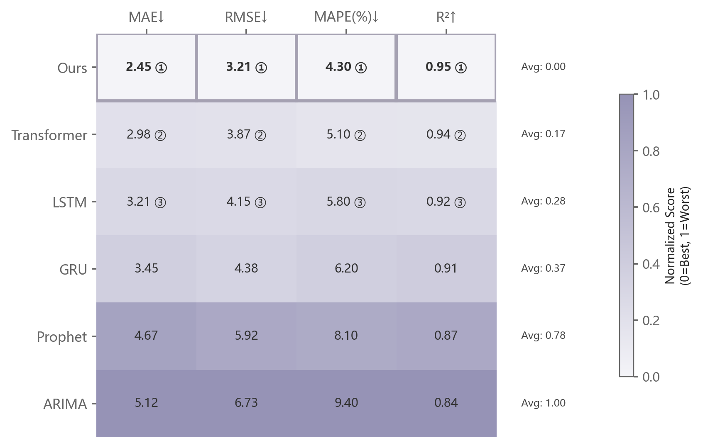

# 060 · 多模型多指标预测热力排名

ID：`empirical.prediction_accuracy_heatmap`

用途：多个模型的误差与拟合指标如何综合比较？

标签：预测、比较、矩阵

别名：多模型多指标预测热力排名

## 数据要求

- 模型×评价指标矩阵
- 指标高低优方向

## 组合结构

模型行、指标列；侧边均分；色条

## 视觉特点

- 原值与名次
- 优胜边框
- 黄红色阶

## 适配注意

代码归一化0为优、1为劣，色条文字却反向；浅色格白字偏淡；卡片保留此限制供适配参考。

## 预览

## 来源与核对

原名称：Multi-Model Prediction Accuracy Heatmap
原始代码：[查看](../sources/empirical.prediction_accuracy_heatmap/original.html)
预览范围：首个主要Python示例
已查看对应预览并核对主要绘图和数据代码；卡片不是统计有效性认证。

## 相近候选

- [归一化多指标雷达对比](academic.latent_interpolation.md)
- [多方案雷达与交替背景环](competition.radar.md)
- [多指标平行坐标](advanced.parallel_coordinates.md)
- [多指标方法排名热力图](advanced.method_heatmap.md)

<!-- fidelity:start -->
## 源码保真要点

以当前完整配方源码为底稿；下列行号指向解释预览的快照。数据适配不应顺手删掉这些视觉结构。

### 原值名次与优胜边框

- 保留重点：保留归一化着色、格内原值与名次、每指标优胜框和侧边汇总；框依据优劣方向确定。
- 可适配：模型数、指标数、方向与综合方式可变，不把小误差当低表现。
- 源码：[L21–21](../sources/empirical.prediction_accuracy_heatmap/original.html#L21) · [L31–32](../sources/empirical.prediction_accuracy_heatmap/original.html#L31) · [L34–35](../sources/empirical.prediction_accuracy_heatmap/original.html#L34) · [L44–44](../sources/empirical.prediction_accuracy_heatmap/original.html#L44)

按现有审图流程对照实际输出；有疑问时可用[源码差异提示](../../template-fidelity.md)。

## 项目配色

热图默认读取项目配色；连续插值、中性色、透明度及数据归一化保留，数值文字按实际底色选择对比色。
