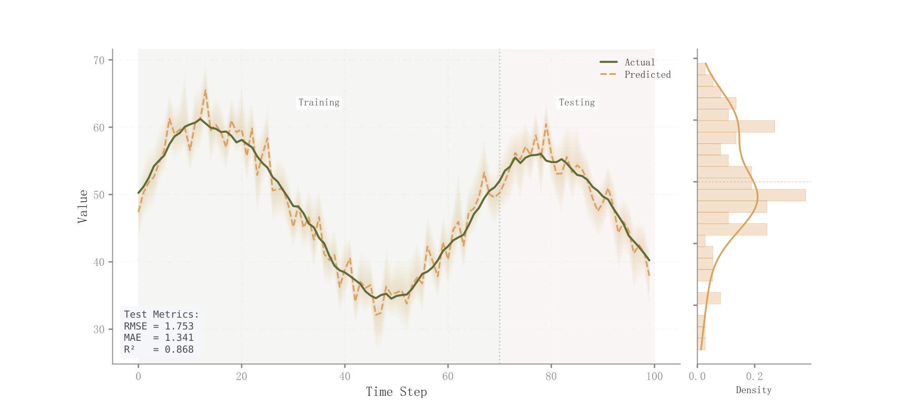

# 059 · 时序预测与误差侧分布

ID：`empirical.prediction_ci`

用途：预测跟踪真实走势怎样，误差分布如何？

标签：预测、误差、组合

别名：时序预测与误差侧分布

## 数据要求

- 有序真实值、预测值、预测区间
- 训练测试分界

## 组合结构

左时序实际与预测；右竖向误差直方与密度

## 视觉特点

- 透明预测带
- 训练测试背景
- 误差指标框

## 适配注意

右侧是残差分布，非左图数值边际；训练测试划分及区间必须对应实际结果。

## 预览

## 来源与核对

原名称：Prediction vs Actual with CI Band
原始代码：[查看](../sources/empirical.prediction_ci/original.html)
预览范围：首个主要Python示例
已查看对应预览并核对主要绘图和数据代码；卡片不是统计有效性认证。

## 相近候选

- [历史与预测分位数扇形图](advanced.fan.md)
- [概率校准与预测概率分布](advanced.calibration.md)
- [预测对实际散点与下方残差分布](competition.prediction_actual.md)

<!-- fidelity:start -->
## 源码保真要点

以当前完整配方源码为底稿；下列行号指向解释预览的快照。数据适配不应顺手删掉这些视觉结构。

### 预测带与侧边误差分布

- 保留重点：保留主图透明预测带、真实/预测线型区分、训练测试分界，以及右侧竖向误差直方和密度。
- 可适配：训练边界、预测区间、误差样本和评价指标重算；侧分布共用误差值轴，不能误当预测轴边际。
- 源码：[L19–19](../sources/empirical.prediction_ci/original.html#L19) · [L20–20](../sources/empirical.prediction_ci/original.html#L20) · [L30–31](../sources/empirical.prediction_ci/original.html#L30) · [L33–33](../sources/empirical.prediction_ci/original.html#L33) · [L34–34](../sources/empirical.prediction_ci/original.html#L34) · [L49–49](../sources/empirical.prediction_ci/original.html#L49) · [L51–51](../sources/empirical.prediction_ci/original.html#L51)

按现有审图流程对照实际输出；有疑问时可用[源码差异提示](../../template-fidelity.md)。
