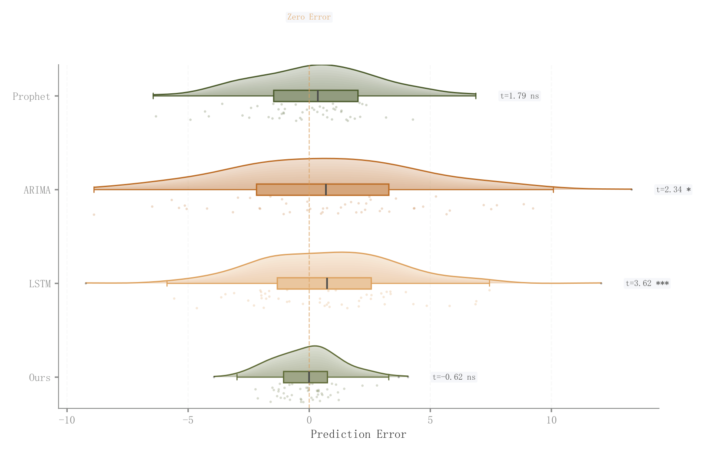

# 061 · 模型误差横向雨云

ID：`empirical.prediction_error_raincloud`

用途：模型误差偏移、离散和长尾怎样不同？

标签：预测、误差、分布

别名：模型误差横向雨云

## 数据要求

- 每模型逐样本预测误差

## 组合结构

逐行半密度、箱线和散点

## 视觉特点

- 透明云层
- 零误差线
- 标准差与正态性标注

## 适配注意

不能由RMSE单值重建误差分布；KDE带宽与尾部尺度会影响形态。

## 预览

## 来源与核对

原名称：Prediction Error Distribution (Rain Cloud)
原始代码：[查看](../sources/empirical.prediction_error_raincloud/original.html)
预览范围：首个主要Python示例
已查看对应预览并核对主要绘图和数据代码；卡片不是统计有效性认证。

## 相近候选

- [竖向雨云分布组合](basic.raincloud.md)
- [完整小提琴与箱线显著性比较](basic.raincloud_violin.md)
- [类别内多方法小提琴](advanced.grouped_violin.md)
- [堆叠山脊密度](advanced.ridgeline.md)
- [横向长尾分布雨云与分位标记](empirical.raincloud.md)
- [雨云分布与效应量显著性](academic.confusion_matrix.md)

<!-- fidelity:start -->
## 源码保真要点

以当前完整配方源码为底稿；下列行号指向解释预览的快照。数据适配不应顺手删掉这些视觉结构。

### 误差云与零参考

- 保留重点：保留横向误差云层、深轮廓、箱线与抖动样本，以及零误差线和异常标记。
- 可适配：分组、带宽、异常阈值可变；误差方向、离散度和检验结果由实际预测计算。
- 源码：[L23–23](../sources/empirical.prediction_error_raincloud/original.html#L23) · [L24–24](../sources/empirical.prediction_error_raincloud/original.html#L24) · [L25–25](../sources/empirical.prediction_error_raincloud/original.html#L25) · [L27–31](../sources/empirical.prediction_error_raincloud/original.html#L27) · [L34–34](../sources/empirical.prediction_error_raincloud/original.html#L34) · [L40–40](../sources/empirical.prediction_error_raincloud/original.html#L40) · [L49–49](../sources/empirical.prediction_error_raincloud/original.html#L49)

按现有审图流程对照实际输出；有疑问时可用[源码差异提示](../../template-fidelity.md)。
