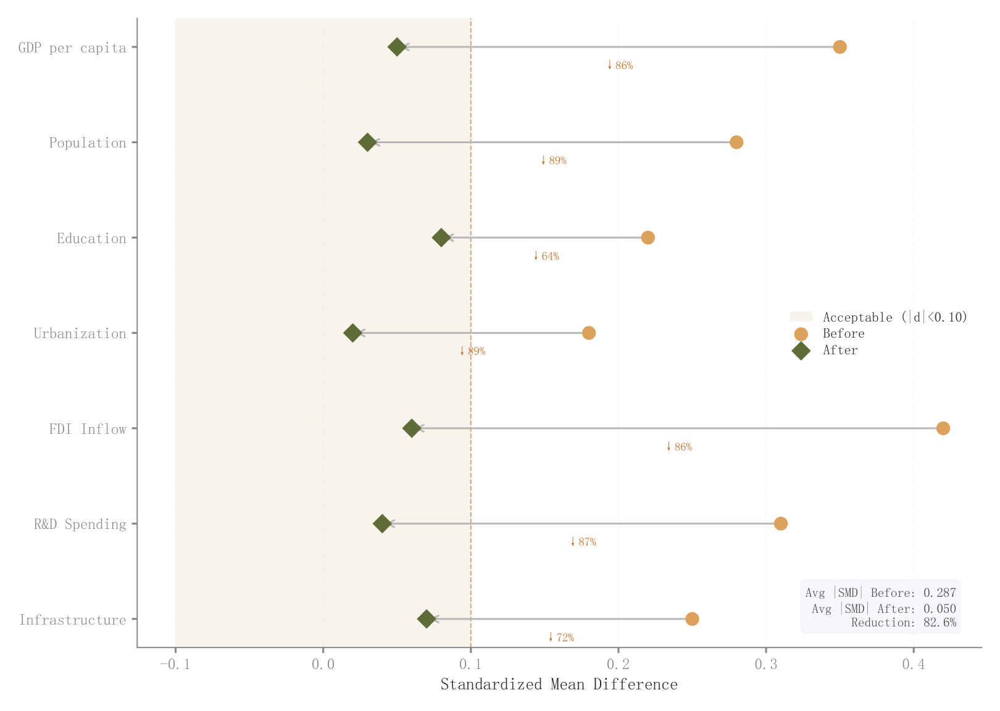

# 058 · 匹配前后协变量平衡图

ID：`empirical.psm_balance`

用途：匹配后协变量差异是否缩小？

标签：诊断、比较、因果

别名：love plot、SMD、PSM、协变量平衡

## 数据要求

- 各协变量匹配前后标准化差异

## 组合结构

每协变量一行；两组点与改善箭头

## 视觉特点

- 阈值浅色区
- 圆点菱形区分
- 改善率文字

## 适配注意

模板只展示SMD，未执行匹配；负值、绝对值和接近零分母需明确，阈值按研究口径设定。

## 预览

## 来源与核对

原名称：PSM Balance (Love Plot)
原始代码：[查看](../sources/empirical.psm_balance/original.html)
预览范围：首个主要Python示例
已查看对应预览并核对主要绘图和数据代码；卡片不是统计有效性认证。

<!-- fidelity:start -->
## 源码保真要点

以当前完整配方源码为底稿；下列行号指向解释预览的快照。数据适配不应顺手删掉这些视觉结构。

### 阈值浅区和匹配改善

- 保留重点：保留阈值浅区、匹配前圆点/后菱形、逐协变量改善箭头及数值列。
- 可适配：协变量、SMD 与阈值据实更新，方向和是否改善不能照搬示例。
- 源码：[L11–11](../sources/empirical.psm_balance/original.html#L11) · [L15–16](../sources/empirical.psm_balance/original.html#L15) · [L21–21](../sources/empirical.psm_balance/original.html#L21) · [L22–22](../sources/empirical.psm_balance/original.html#L22)

按现有审图流程对照实际输出；有疑问时可用[源码差异提示](../../template-fidelity.md)。
