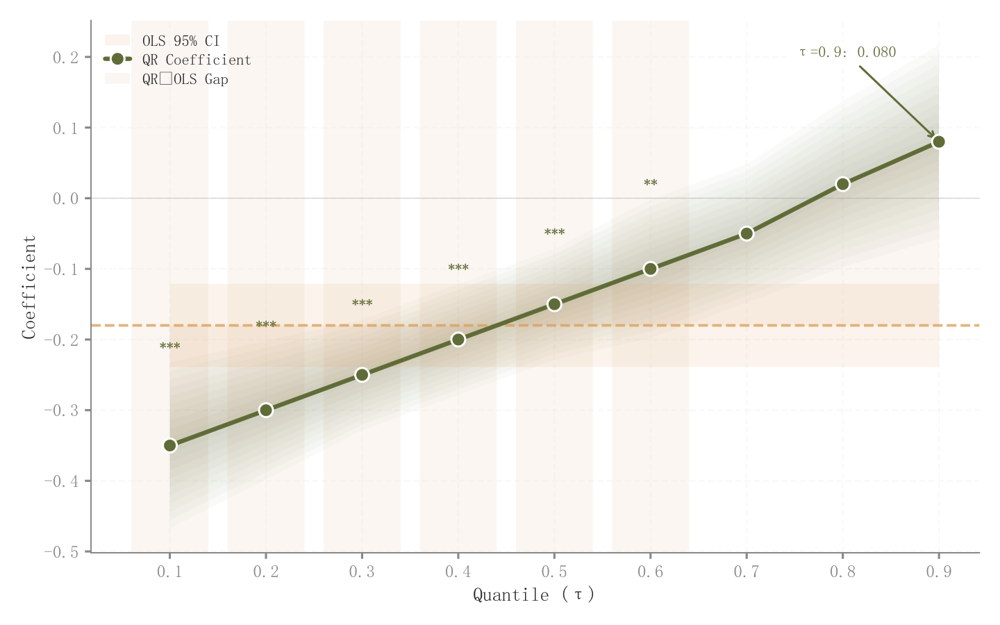

# 057 · 分位数回归与OLS对照

ID：`empirical.quantile_regression`

用途：效应在响应分布不同分位是否变化？

标签：解释、误差、比较

别名：分位数回归与OLS对照

## 数据要求

- 各分位系数与SE
- OLS系数及SE

## 组合结构

分位数横轴；系数曲线；OLS水平参考

## 视觉特点

- 十层区间带
- OLS浅带
- 差值填充
- 显著性背景

## 适配注意

示例未拟合回归；不同模型的区间与样本口径需一致；色带不是响应变量分布。

## 预览

## 来源与核对

原名称：Quantile Regression
原始代码：[查看](../sources/empirical.quantile_regression/original.html)
预览范围：首个主要Python示例
已查看对应预览并核对主要绘图和数据代码；卡片不是统计有效性认证。

<!-- fidelity:start -->
## 源码保真要点

以当前完整配方源码为底稿；下列行号指向解释预览的快照。数据适配不应顺手删掉这些视觉结构。

### QR区间与OLS参照分离

- 保留重点：保留 QR 十层区间、OLS 水平浅带和两者差值填充，不能把不同含义合为一个阴影。
- 可适配：分位点、系数和标准误由模型计算；显著区域和差值方向据实更新。
- 源码：[L13–13](../sources/empirical.quantile_regression/original.html#L13) · [L15–15](../sources/empirical.quantile_regression/original.html#L15) · [L16–16](../sources/empirical.quantile_regression/original.html#L16) · [L22–22](../sources/empirical.quantile_regression/original.html#L22) · [L23–24](../sources/empirical.quantile_regression/original.html#L23) · [L25–25](../sources/empirical.quantile_regression/original.html#L25)

按现有审图流程对照实际输出；有疑问时可用[源码差异提示](../../template-fidelity.md)。
