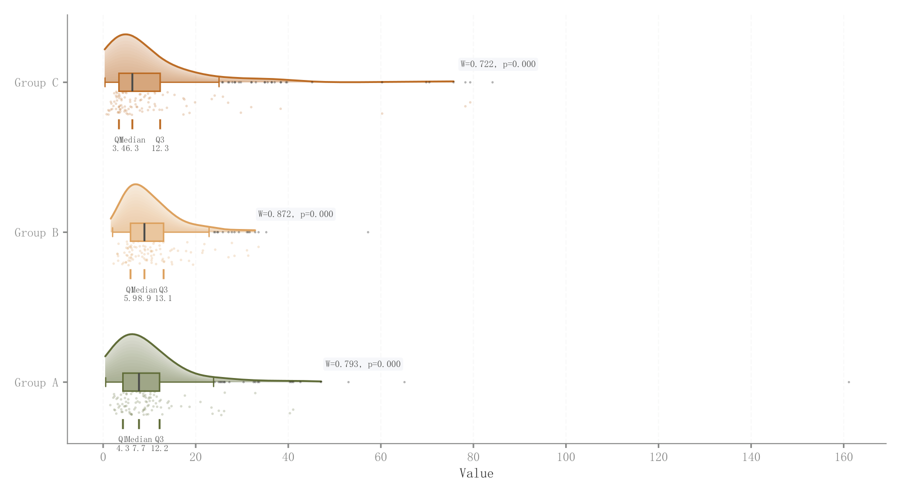

# 052 · 横向长尾分布雨云与分位标记

ID：`empirical.raincloud`

用途：偏态分布的尾部、中心和组间差异怎样？

标签：分布、比较、组合

别名：横向长尾分布雨云与分位标记

## 数据要求

- 各组原始连续样本

## 组合结构

横向半密度＋箱线＋下方散点；分位数标记

## 视觉特点

- 十五层透明密度
- 深轮廓
- 正态性统计框

## 适配注意

预览长尾压缩主体；KDE只到99分位但点仍可更远；正态性检验示例只取前50样本。

## 预览

## 来源与核对

原名称：Distribution (Rain Cloud with Gradient KDE)
原始代码：[查看](../sources/empirical.raincloud/original.html)
预览范围：首个主要Python示例
已查看对应预览并核对主要绘图和数据代码；卡片不是统计有效性认证。

## 相近候选

- [竖向雨云分布组合](basic.raincloud.md)
- [完整小提琴与箱线显著性比较](basic.raincloud_violin.md)
- [类别内多方法小提琴](advanced.grouped_violin.md)
- [堆叠山脊密度](advanced.ridgeline.md)
- [雨云分布与效应量显著性](academic.confusion_matrix.md)
- [模型误差横向雨云](empirical.prediction_error_raincloud.md)

<!-- fidelity:start -->
## 源码保真要点

以当前完整配方源码为底稿；下列行号指向解释预览的快照。数据适配不应顺手删掉这些视觉结构。

### 横向多层云与下方样本

- 保留重点：保留十五层云填充加底层、深轮廓、下方箱线/散点及分位标记，横向值轴一致。
- 可适配：样本量、组数、云高、带宽和标签可变；分位、均值和正态性结果据实计算。
- 源码：[L24–25](../sources/empirical.raincloud/original.html#L24) · [L26–26](../sources/empirical.raincloud/original.html#L26) · [L27–27](../sources/empirical.raincloud/original.html#L27) · [L29–34](../sources/empirical.raincloud/original.html#L29) · [L37–37](../sources/empirical.raincloud/original.html#L37) · [L41–41](../sources/empirical.raincloud/original.html#L41)

按现有审图流程对照实际输出；有疑问时可用[源码差异提示](../../template-fidelity.md)。
