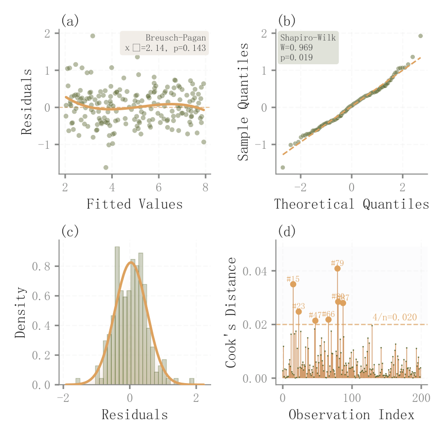

# 054 · 回归残差四面板与影响点

ID：`empirical.residual_diagnostics`

用途：残差形状、正态性与影响点是否异常？

标签：诊断、误差、组合

别名：回归残差四面板与影响点

## 数据要求

- 拟合值、残差、Cook距离
- 对应检验统计

## 组合结构

2×2：残差拟合、Q-Q、分布、Cook距离

## 视觉特点

- 透明点
- 趋势平滑
- 密度填充
- 影响点阈值

## 适配注意

示例Breusch–Pagan文字固定、Cook距离模拟；区别于右下画ACF的竞赛版四面板。

## 预览

## 来源与核对

原名称：Residual Diagnostics (4-panel)
原始代码：[查看](../sources/empirical.residual_diagnostics/original.html)
预览范围：首个主要Python示例
已查看对应预览并核对主要绘图和数据代码；卡片不是统计有效性认证。

## 相近候选

- [残差分布与自相关四面板](competition.residual_diagnostics.md)

<!-- fidelity:start -->
## 源码保真要点

以当前完整配方源码为底稿；下列行号指向解释预览的快照。数据适配不应顺手删掉这些视觉结构。

### 四诊断面板各保留信息层

- 保留重点：保留残差—拟合、Q-Q、分布与 Cook 距离四部分，浅点、趋势线、密度层与影响阈值分工明确。
- 可适配：残差、拟合、模型自由度及影响指标重算，面板比例可调，不能拿随机诊断值适配正式数据。
- 源码：[L12–12](../sources/empirical.residual_diagnostics/original.html#L12) · [L16–16](../sources/empirical.residual_diagnostics/original.html#L16) · [L26–26](../sources/empirical.residual_diagnostics/original.html#L26) · [L29–29](../sources/empirical.residual_diagnostics/original.html#L29) · [L39–39](../sources/empirical.residual_diagnostics/original.html#L39) · [L42–42](../sources/empirical.residual_diagnostics/original.html#L42) · [L44–44](../sources/empirical.residual_diagnostics/original.html#L44) · [L52–52](../sources/empirical.residual_diagnostics/original.html#L52) · [L55–55](../sources/empirical.residual_diagnostics/original.html#L55)

按现有审图流程对照实际输出；有疑问时可用[源码差异提示](../../template-fidelity.md)。
