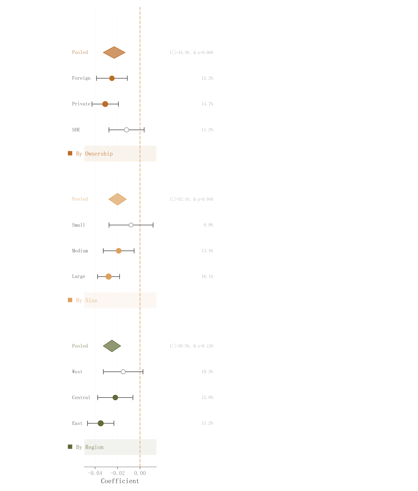

# 056 · 分层异质性森林图

ID：`empirical.subgroup_forest`

用途：效应在地区、规模等分层中是否不同？

标签：比较、误差、因果

别名：subgroup forest、异质性

## 数据要求

- 分层类别下的效应、SE、权重
- 分层汇总与异质性统计

## 组合结构

分组行块；点区间；每块汇总菱形

## 视觉特点

- 浅色组标题带
- 空实心点
- 权重文字列

## 适配注意

预览为窄高图，完整阅读需放大；I²及Q检验是示例输入，不自动估计。

## 预览

## 来源与核对

原名称：Subgroup Forest / Heterogeneity
原始代码：[查看](../sources/empirical.subgroup_forest/original.html)
预览范围：首个主要Python示例
已查看对应预览并核对主要绘图和数据代码；卡片不是统计有效性认证。

## 相近候选

- [效应森林图与权重摘要](empirical.forest.md)
- [多指标点区间与汇总菱形](advanced.dot_ci.md)

<!-- fidelity:start -->
## 源码保真要点

以当前完整配方源码为底稿；下列行号指向解释预览的快照。数据适配不应顺手删掉这些视觉结构。

### 分组行块和组内汇总

- 保留重点：保留浅组标题带、各行点区间与每组汇总菱形，点与文字列对齐。
- 可适配：亚组数量、权重和区间可变；没有有效组内汇总时说明，不直接平均区间。
- 源码：[L23–23](../sources/empirical.subgroup_forest/original.html#L23) · [L28–28](../sources/empirical.subgroup_forest/original.html#L28) · [L29–29](../sources/empirical.subgroup_forest/original.html#L29) · [L30–30](../sources/empirical.subgroup_forest/original.html#L30) · [L32–32](../sources/empirical.subgroup_forest/original.html#L32) · [L37–37](../sources/empirical.subgroup_forest/original.html#L37) · [L38–38](../sources/empirical.subgroup_forest/original.html#L38)

按现有审图流程对照实际输出；有疑问时可用[源码差异提示](../../template-fidelity.md)。
