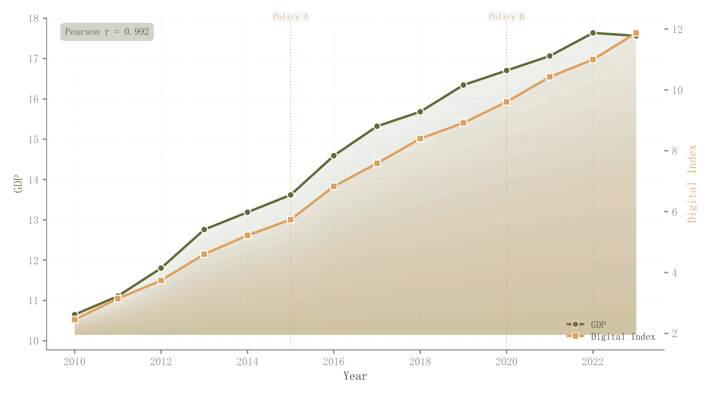

# 053 · 双指标时序与事件背景

ID：`empirical.time_series`

用途：不同单位指标如何共同演化，事件发生在哪里？

标签：趋势、时间、组合

别名：双指标时序与事件背景

## 数据要求

- 同一时间索引下两组数值
- 事件时间

## 组合结构

双纵轴折线；曲线下方填充

## 视觉特点

- 多层渐淡填充
- 不同点形
- 事件竖线
- 相关系数框

## 适配注意

双轴尺度影响观感；共同趋势会影响相关解释；事件标注不表示因果识别。

## 预览

## 来源与核对

原名称：Time Series Trend (Dual Y-axis)
原始代码：[查看](../sources/empirical.time_series/original.html)
预览范围：首个主要Python示例
已查看对应预览并核对主要绘图和数据代码；卡片不是统计有效性认证。

<!-- fidelity:start -->
## 源码保真要点

以当前完整配方源码为底稿；下列行号指向解释预览的快照。数据适配不应顺手删掉这些视觉结构。

### 双轴曲线下的渐淡层

- 保留重点：保留两轴各自多层渐淡填充、白边不同点形及事件线；不用不透明纯色覆盖层次。
- 可适配：数值范围和填充基线随量纲改变，时期、事件和相关摘要来自当前数据。
- 源码：[L15–16](../sources/empirical.time_series/original.html#L15) · [L17–17](../sources/empirical.time_series/original.html#L17) · [L21–22](../sources/empirical.time_series/original.html#L21) · [L23–23](../sources/empirical.time_series/original.html#L23) · [L25–26](../sources/empirical.time_series/original.html#L25) · [L27–28](../sources/empirical.time_series/original.html#L27) · [L31–31](../sources/empirical.time_series/original.html#L31)

按现有审图流程对照实际输出；有疑问时可用[源码差异提示](../../template-fidelity.md)。
