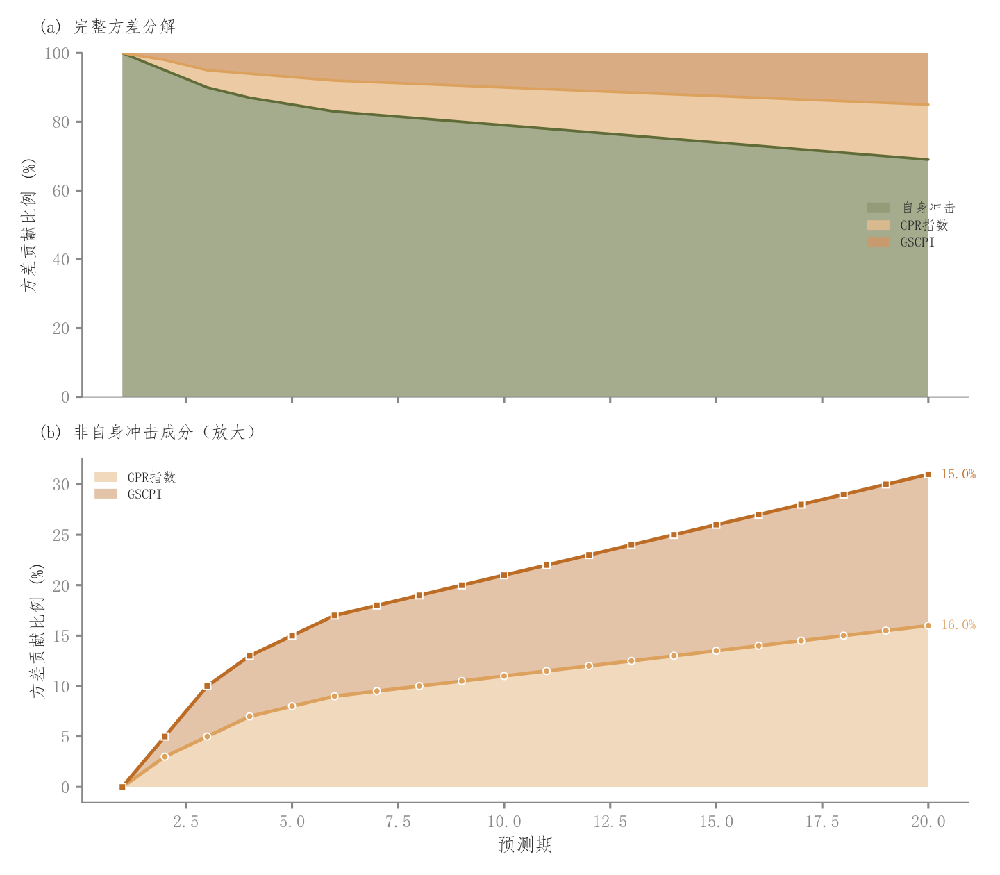

# 066 · 方差分解总览与次要成分放大

ID：`empirical.variance_decomposition`

用途：预测误差方差由哪些冲击贡献，小项如何变化？

标签：组成、趋势、组合

别名：方差分解总览与次要成分放大

## 数据要求

- 期数×冲击来源的贡献份额

## 组合结构

上完整堆叠面积；下排除主成分后放大

## 视觉特点

- 共享期数
- 浅色贡献带
- 末端份额

## 适配注意

下图展示次要成分原份额而非重新归一化；数值需来自真实方差分解并检验加总口径。

## 预览

## 来源与核对

原名称：Variance Decomposition (Stacked Area with Smart Scaling)
原始代码：[查看](../sources/empirical.variance_decomposition/original.html)
预览范围：首个主要Python示例
已查看对应预览并核对主要绘图和数据代码；卡片不是统计有效性认证。

## 相近候选

- [堆叠面积与事件标记](basic.area.md)
- [居中流带图](advanced.streamgraph.md)

<!-- fidelity:start -->
## 源码保真要点

以当前完整配方源码为底稿；下列行号指向解释预览的快照。数据适配不应顺手删掉这些视觉结构。

### 完整堆叠与次成分放大

- 保留重点：保留上部全成分堆叠和下部排除主成分后的放大，浅填充与独立轮廓共同表达贡献。
- 可适配：成分数和期数可变，上下共用同一期数，放大面板保持原份额解释，不偷偷重新归一化。
- 源码：[L17–19](../sources/empirical.variance_decomposition/original.html#L17) · [L20–20](../sources/empirical.variance_decomposition/original.html#L20) · [L21–21](../sources/empirical.variance_decomposition/original.html#L21) · [L30–30](../sources/empirical.variance_decomposition/original.html#L30) · [L31–31](../sources/empirical.variance_decomposition/original.html#L31) · [L32–33](../sources/empirical.variance_decomposition/original.html#L32) · [L34–35](../sources/empirical.variance_decomposition/original.html#L34)

按现有审图流程对照实际输出；有疑问时可用[源码差异提示](../../template-fidelity.md)。
