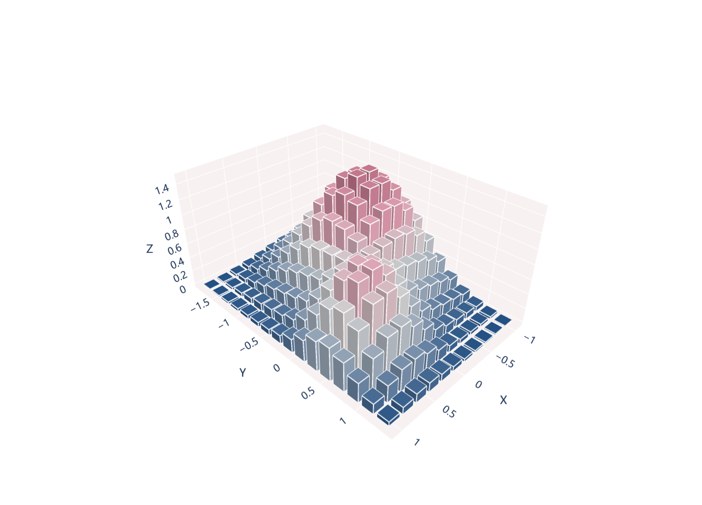

# 三维方柱曲面

模板 122 · `screenshot.block_surface_3d`

标签：三维、柱状、标量场

## 用途与数据

独立网格方柱、全局高度色阶、十二条白色立方体棱线，用于二维网格及每格非负高度的展示。

二维网格及每格非负高度；本例高度并非频数

## 结构与视觉特点

独立网格方柱、全局高度色阶、十二条白色立方体棱线

## 适配和来源

代码截图恢复与适配。原标题称三维直方图，但高度来自连续合成曲面；卡片称方柱曲面，真实频数需先分箱计数。 使用Plotly交互显示；预览通过Kaleido导出，画布和边距适配截图检查。3D PDF内部仍含栅格渲染。

[完整代码](../sources/screenshot.block_surface_3d/restored.py) · [来源说明](../sources/screenshot.block_surface_3d/SOURCE.md) · [参考截图](../sources/screenshot.block_surface_3d/reference.jpg)

## 源码保真要点

保留：独立网格方柱、全局高度色阶、十二条白色立方体棱线；保留源码中对应的独立绘制层和视觉编码。

可适配：二维网格及每格非负高度；本例高度并非频数；可调整数据、标签、尺寸、视角及配色角色，但各色阶、透明度、轮廓和图例语义需对应。

- 源码定位：[sources/screenshot.block_surface_3d/restored.html#L36](../sources/screenshot.block_surface_3d/restored.html#L36)
- 源码定位：[sources/screenshot.block_surface_3d/restored.html#L47](../sources/screenshot.block_surface_3d/restored.html#L47)
