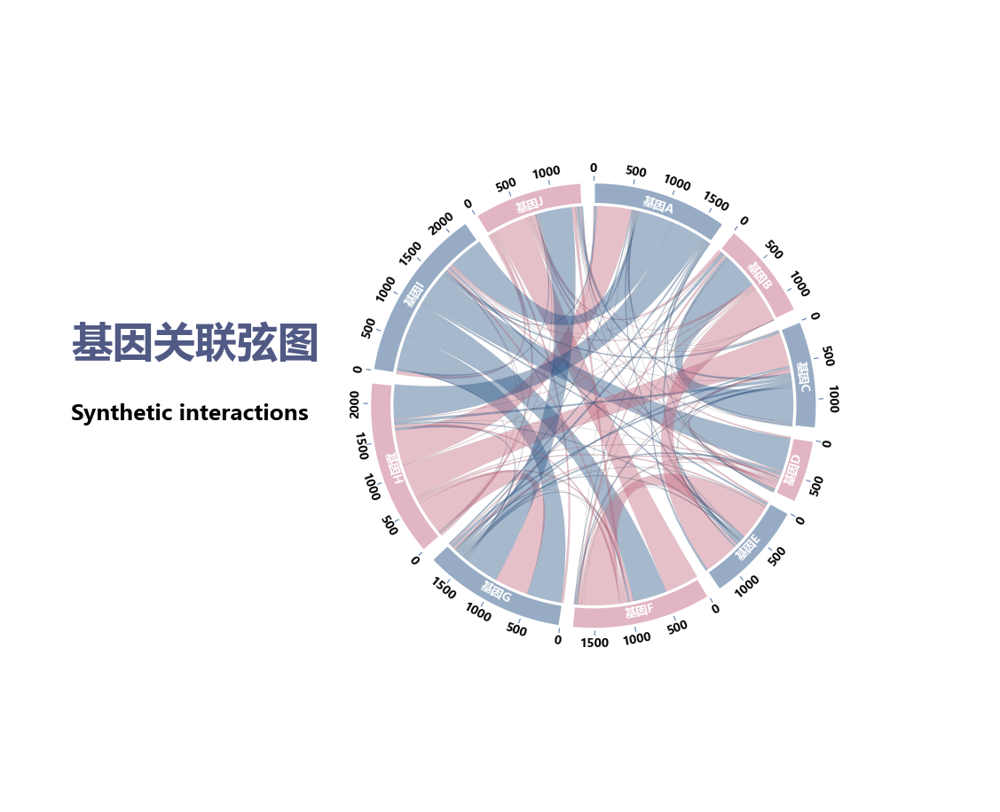

# 透明弦图

模板 131 · `screenshot.chord`

标签：网络、流量、关系

## 用途与数据

扇区轨道、透明弦带、刻度和白色轨道边界，用于非负方阵，行列类别顺序一致的展示。

非负方阵，行列类别顺序一致；明确方向语义

## 结构与视觉特点

扇区轨道、透明弦带、刻度和白色轨道边界

## 适配和来源

代码截图恢复与适配。恢复全部可见绘图层与示例数据；调整导入、缩进、标签或输出边距以兼容当前运行环境。

[完整代码](../sources/screenshot.chord/restored.py) · [来源说明](../sources/screenshot.chord/SOURCE.md) · [参考截图](../sources/screenshot.chord/reference.jpg)

## 源码保真要点

保留：扇区轨道、透明弦带、刻度和白色轨道边界；保留源码中对应的独立绘制层和视觉编码。

可适配：非负方阵，行列类别顺序一致；明确方向语义；可调整数据、标签、尺寸、视角及配色角色，但各色阶、透明度、轮廓和图例语义需对应。

- 源码定位：[sources/screenshot.chord/restored.html#L30](../sources/screenshot.chord/restored.html#L30)
- 源码定位：[sources/screenshot.chord/restored.html#L36](../sources/screenshot.chord/restored.html#L36)
