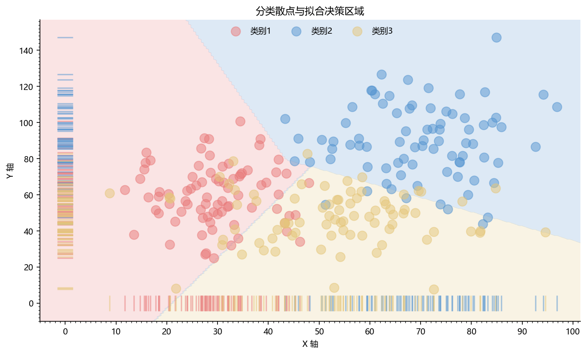

# 分类散点与决策区域

模板 138 · `screenshot.classified_scatter`

标签：分类、散点、机器学习

## 用途与数据

半透明散点、淡色决策背景、横纵 rug 边际标记，用于两个数值特征和类别标签的展示。

两个数值特征和类别标签；背景为拟合模型预测

## 结构与视觉特点

半透明散点、淡色决策背景、横纵 rug 边际标记

## 适配和来源

代码截图恢复与适配。恢复全部可见绘图层与示例数据；调整导入、缩进、标签或输出边距以兼容当前运行环境。

[完整代码](../sources/screenshot.classified_scatter/restored.py) · [来源说明](../sources/screenshot.classified_scatter/SOURCE.md) · [参考截图](../sources/screenshot.classified_scatter/reference.jpg)

## 源码保真要点

保留：半透明散点、淡色决策背景、横纵 rug 边际标记；保留源码中对应的独立绘制层和视觉编码。

可适配：两个数值特征和类别标签；背景为拟合模型预测；可调整数据、标签、尺寸、视角及配色角色，但各色阶、透明度、轮廓和图例语义需对应。

- 源码定位：[sources/screenshot.classified_scatter/restored.html#L32](../sources/screenshot.classified_scatter/restored.html#L32)
- 源码定位：[sources/screenshot.classified_scatter/restored.html#L34](../sources/screenshot.classified_scatter/restored.html#L34)
