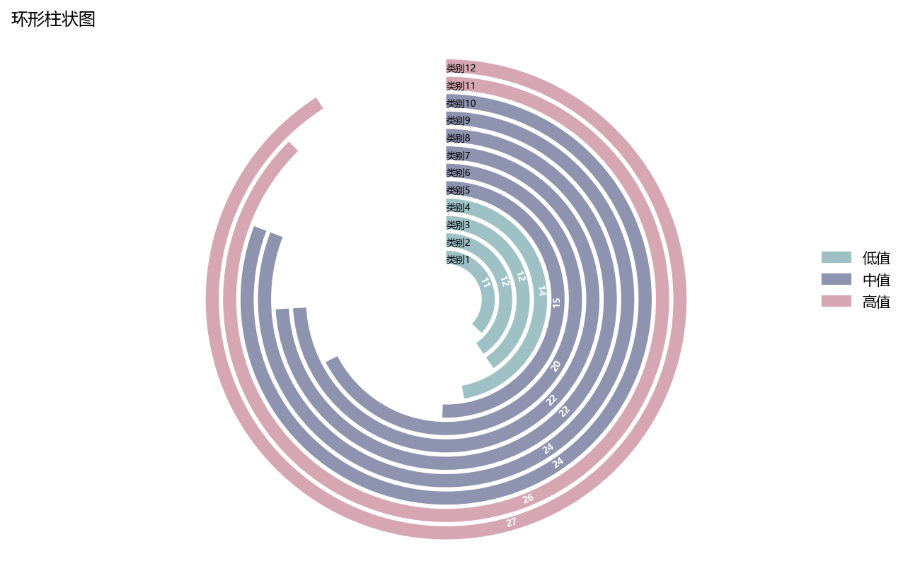

# 同心环形柱状图

模板 125 · `screenshot.concentric_bars`

标签：排序、比较、极坐标

## 用途与数据

同心圆弧、三档颜色、圆弧内数值和径向标签，用于类别及非负数值的展示。

类别及非负数值；所有环共享角度尺度

## 结构与视觉特点

同心圆弧、三档颜色、圆弧内数值和径向标签

## 适配和来源

代码截图恢复与适配。恢复全部可见绘图层与示例数据；调整导入、缩进、标签或输出边距以兼容当前运行环境。

[完整代码](../sources/screenshot.concentric_bars/restored.py) · [来源说明](../sources/screenshot.concentric_bars/SOURCE.md) · [参考截图](../sources/screenshot.concentric_bars/reference.jpg)

## 源码保真要点

保留：同心圆弧、三档颜色、圆弧内数值和径向标签；保留源码中对应的独立绘制层和视觉编码。

可适配：类别及非负数值；所有环共享角度尺度；可调整数据、标签、尺寸、视角及配色角色，但各色阶、透明度、轮廓和图例语义需对应。

- 源码定位：[sources/screenshot.concentric_bars/restored.html#L31](../sources/screenshot.concentric_bars/restored.html#L31)
- 源码定位：[sources/screenshot.concentric_bars/restored.html#L32](../sources/screenshot.concentric_bars/restored.html#L32)
