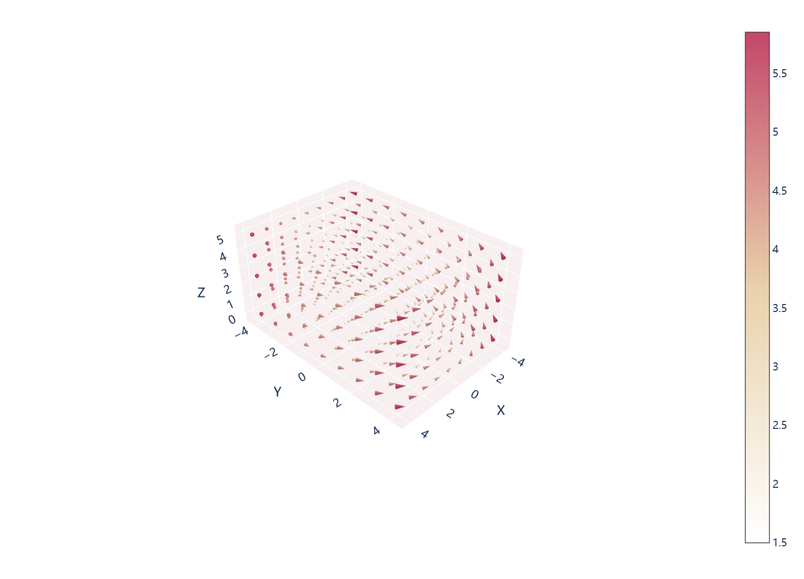

# 三维涡旋向量图

模板 116 · `screenshot.cone_vortex`

标签：三维、向量场

## 用途与数据

三维锥体方向、速度色阶、场景背景与长宽比，用于x、y、z、u、v、w 六列的展示。

x、y、z、u、v、w 六列；坐标和向量单位明确

## 结构与视觉特点

三维锥体方向、速度色阶、场景背景与长宽比

## 适配和来源

代码截图恢复，原数据缺失。vortex.csv未提供，005/029只是部分数值截图；默认改用明确标注的解析涡旋合成场。 原代码sizeref=60依赖原向量单位；演示场用1.3。真实数据须按单位调整。 使用Plotly交互显示；预览通过Kaleido导出，画布和边距适配截图检查。3D PDF内部仍含栅格渲染。

[完整代码](../sources/screenshot.cone_vortex/restored.py) · [来源说明](../sources/screenshot.cone_vortex/SOURCE.md) · [参考截图](../sources/screenshot.cone_vortex/reference.jpg)

## 源码保真要点

保留：三维锥体方向、速度色阶、场景背景与长宽比；保留源码中对应的独立绘制层和视觉编码。

可适配：x、y、z、u、v、w 六列；坐标和向量单位明确；可调整数据、标签、尺寸、视角及配色角色，但各色阶、透明度、轮廓和图例语义需对应。

- 源码定位：[sources/screenshot.cone_vortex/restored.html#L26](../sources/screenshot.cone_vortex/restored.html#L26)
