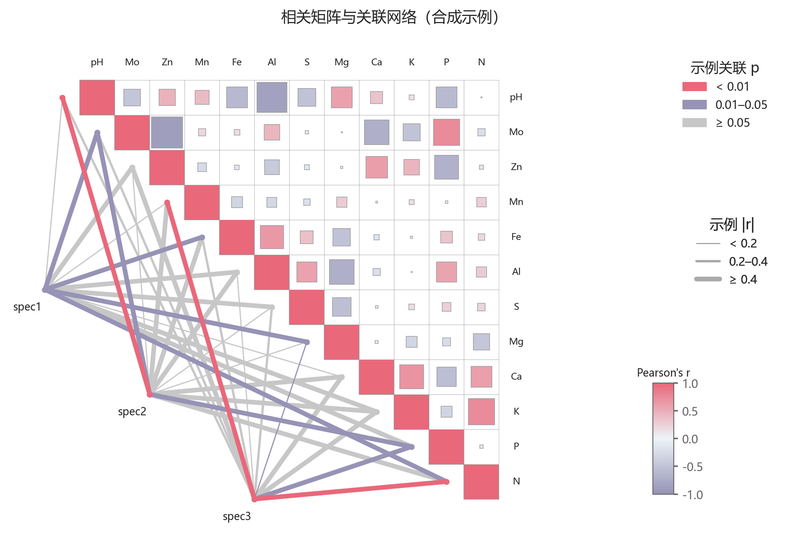

# 相关矩阵与连线网络

模板 135 · `screenshot.correlation_network`

标签：相关、矩阵、网络、组合

## 用途与数据

三角矩阵、方块大小及发散色、连线宽度颜色、三种图例，用于相关矩阵及每个网络节点到特征的 r/p 表的展示。

相关矩阵及每个网络节点到特征的 r/p 表

## 结构与视觉特点

三角矩阵、方块大小及发散色、连线宽度颜色、三种图例

## 适配和来源

代码截图恢复与适配。原示例随机方阵并非有效相关矩阵；演示改由合成样本计算对称Pearson矩阵。 原方块宽高直接使用带符号r；改为abs(r)，颜色保留符号。线宽按abs(r)分档。 修正连续颜色插值和标签与矩阵坐标的对应。网络r/p仍为演示输入，不声称做了Mantel检验；真实任务需提供实际检验结果。

[完整代码](../sources/screenshot.correlation_network/restored.py) · [来源说明](../sources/screenshot.correlation_network/SOURCE.md) · [参考截图](../sources/screenshot.correlation_network/reference.jpg)

## 源码保真要点

保留：三角矩阵、方块大小及发散色、连线宽度颜色、三种图例；保留源码中对应的独立绘制层和视觉编码。

可适配：相关矩阵及每个网络节点到特征的 r/p 表；可调整数据、标签、尺寸、视角及配色角色，但各色阶、透明度、轮廓和图例语义需对应。

- 源码定位：[sources/screenshot.correlation_network/restored.html#L38](../sources/screenshot.correlation_network/restored.html#L38)
- 源码定位：[sources/screenshot.correlation_network/restored.html#L40](../sources/screenshot.correlation_network/restored.html#L40)
- 源码定位：[sources/screenshot.correlation_network/restored.html#L46](../sources/screenshot.correlation_network/restored.html#L46)
- 源码定位：[sources/screenshot.correlation_network/restored.html#L57](../sources/screenshot.correlation_network/restored.html#L57)

## 项目配色

热图默认读取项目配色；连续插值、中性色、透明度及数据归一化保留，数值文字按实际底色选择对比色。
