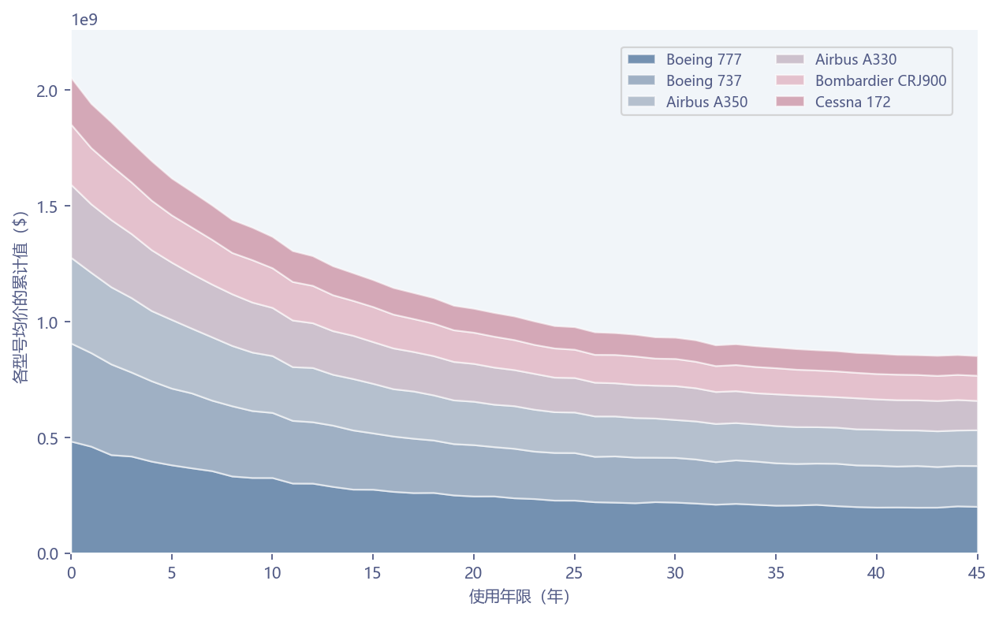

# 多型号价格堆叠面积

模板 124 · `screenshot.depreciation_area`

标签：趋势、组成、比较

## 用途与数据

按总量排序、透明面积、白色分界和两列图例，用于Model、Yas、Fiyat ($) 长表的展示。

Model、Yas、Fiyat ($) 长表；同一年龄覆盖全部型号

## 结构与视觉特点

按总量排序、透明面积、白色分界和两列图例

## 适配和来源

代码截图恢复，原数据缺失。原airplane_price_dataset.csv未提供，补充同字段固定种子的合成长表。 年龄排序后再绘制；缺失型号×年龄单元报错而非静默补零。图轴明确是型号均价的累计值，不代表市场总额。

[完整代码](../sources/screenshot.depreciation_area/restored.py) · [来源说明](../sources/screenshot.depreciation_area/SOURCE.md) · [参考截图](../sources/screenshot.depreciation_area/reference.jpg)

## 源码保真要点

保留：按总量排序、透明面积、白色分界和两列图例；保留源码中对应的独立绘制层和视觉编码。

可适配：Model、Yas、Fiyat ($) 长表；同一年龄覆盖全部型号；可调整数据、标签、尺寸、视角及配色角色，但各色阶、透明度、轮廓和图例语义需对应。

- 源码定位：[sources/screenshot.depreciation_area/restored.html#L48](../sources/screenshot.depreciation_area/restored.html#L48)
