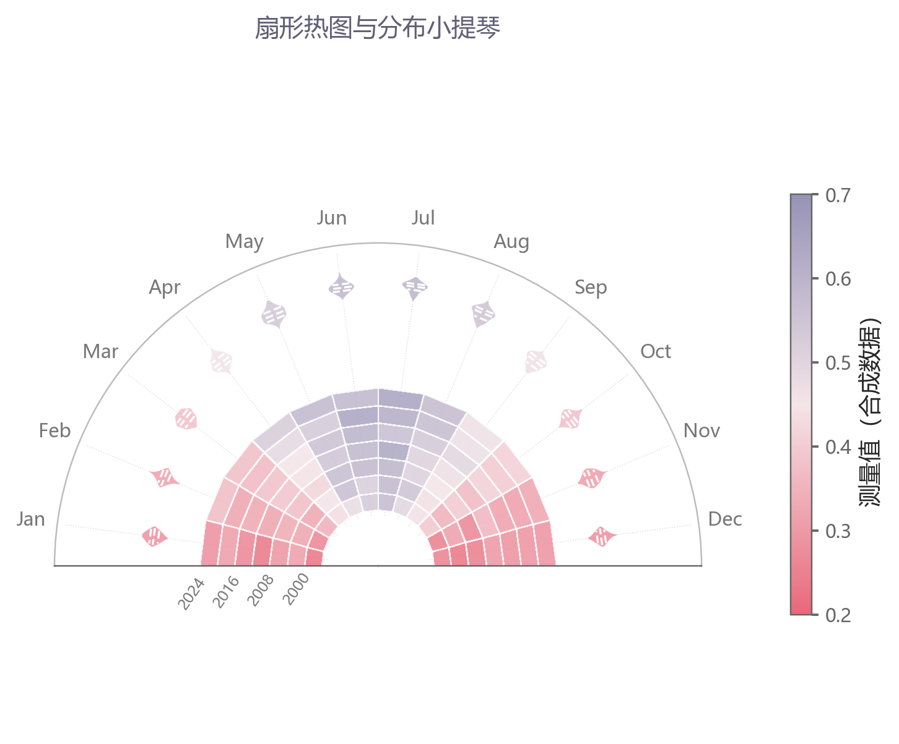

# 扇形小提琴与热图

模板 110 · `screenshot.fan_violin_heatmap`

标签：分布、矩阵、极坐标、组合

## 用途与数据

半圆热图、小提琴分布、外圈刻度与色标，用于各类别的样本分布，以及类别×指标数值矩阵的展示。

各类别的样本分布，以及类别×指标数值矩阵

## 结构与视觉特点

半圆热图、小提琴分布、外圈刻度与色标

## 适配和来源

仅效果图，按图重建。仅有截图006效果图，未提供代码；按图重建扇形热图、KDE小提琴与四分位线，附可重复合成数据。 径向年份隔项显示并旋转，避免重叠；保留每一个热图环。

[完整代码](../sources/screenshot.fan_violin_heatmap/restored.py) · [来源说明](../sources/screenshot.fan_violin_heatmap/SOURCE.md) · [参考截图](../sources/screenshot.fan_violin_heatmap/reference.jpg)

## 源码保真要点

保留：半圆热图、小提琴分布、外圈刻度与色标；保留源码中对应的独立绘制层和视觉编码。

可适配：各类别的样本分布，以及类别×指标数值矩阵；可调整数据、标签、尺寸、视角及配色角色，但各色阶、透明度、轮廓和图例语义需对应。

- 源码定位：[sources/screenshot.fan_violin_heatmap/restored.html#L32](../sources/screenshot.fan_violin_heatmap/restored.html#L32)
- 源码定位：[sources/screenshot.fan_violin_heatmap/restored.html#L39](../sources/screenshot.fan_violin_heatmap/restored.html#L39)
- 源码定位：[sources/screenshot.fan_violin_heatmap/restored.html#L42](../sources/screenshot.fan_violin_heatmap/restored.html#L42)
- 源码定位：[sources/screenshot.fan_violin_heatmap/restored.html#L47](../sources/screenshot.fan_violin_heatmap/restored.html#L47)
- 源码定位：[sources/screenshot.fan_violin_heatmap/restored.html#L50](../sources/screenshot.fan_violin_heatmap/restored.html#L50)

## 项目配色

热图默认读取项目配色；连续插值、中性色、透明度及数据归一化保留，数值文字按实际底色选择对比色。
