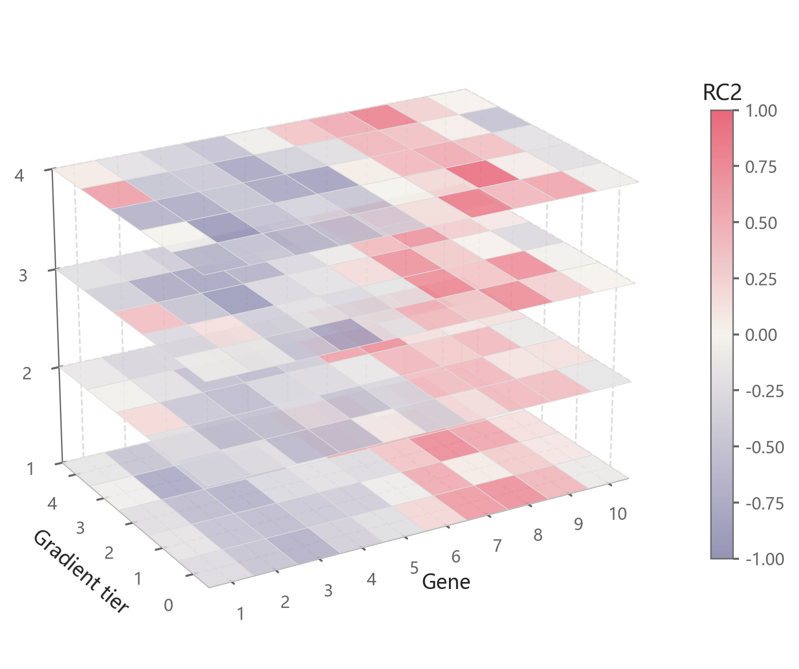

# 三维分层热图

模板 112 · `screenshot.heatmap_slabs_3d`

标签：三维、矩阵、组合

## 用途与数据

多层热图平面、共享发散色标、单元格与三维轴，用于同形状的多层数值矩阵的展示。

同形状的多层数值矩阵

## 结构与视觉特点

多层热图平面、共享发散色标、单元格与三维轴

## 适配和来源

仅效果图，按图重建。仅有010效果图（署名 @Doc mm），整段实现按视觉结构重建；矩阵是固定种子的合成数据。

[完整代码](../sources/screenshot.heatmap_slabs_3d/restored.py) · [来源说明](../sources/screenshot.heatmap_slabs_3d/SOURCE.md) · [参考截图](../sources/screenshot.heatmap_slabs_3d/reference.jpg)

## 源码保真要点

保留：多层热图平面、共享发散色标、单元格与三维轴；保留源码中对应的独立绘制层和视觉编码。

可适配：同形状的多层数值矩阵；可调整数据、标签、尺寸、视角及配色角色，但各色阶、透明度、轮廓和图例语义需对应。

- 源码定位：[sources/screenshot.heatmap_slabs_3d/restored.html#L32](../sources/screenshot.heatmap_slabs_3d/restored.html#L32)
- 源码定位：[sources/screenshot.heatmap_slabs_3d/restored.html#L38](../sources/screenshot.heatmap_slabs_3d/restored.html#L38)

## 项目配色

热图默认读取项目配色；连续插值、中性色、透明度及数据归一化保留，数值文字按实际底色选择对比色。
