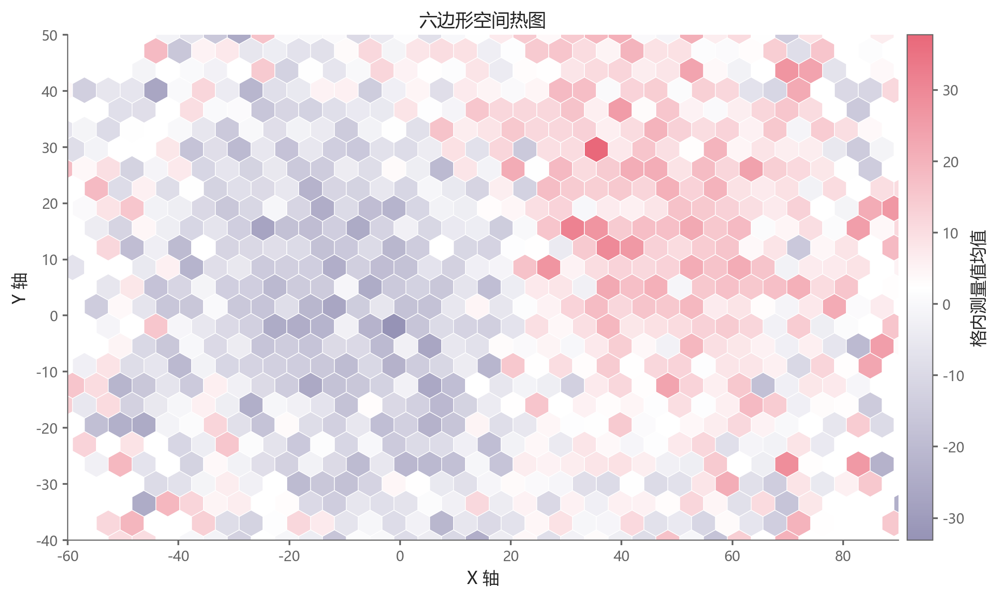

# 六边形空间热图

模板 137 · `screenshot.hexbin`

标签：空间、密度、聚合

## 用途与数据

六边形网格、白色细边、发散色阶和共享色标，用于x、y 和测量值 z的展示。

x、y 和测量值 z；按六边形内均值聚合

## 结构与视觉特点

六边形网格、白色细边、发散色阶和共享色标

## 适配和来源

代码截图恢复与适配。恢复全部可见绘图层与示例数据；调整导入、缩进、标签或输出边距以兼容当前运行环境。

[完整代码](../sources/screenshot.hexbin/restored.py) · [来源说明](../sources/screenshot.hexbin/SOURCE.md) · [参考截图](../sources/screenshot.hexbin/reference.jpg)

## 源码保真要点

保留：六边形网格、白色细边、发散色阶和共享色标；保留源码中对应的独立绘制层和视觉编码。

可适配：x、y 和测量值 z；按六边形内均值聚合；可调整数据、标签、尺寸、视角及配色角色，但各色阶、透明度、轮廓和图例语义需对应。

- 源码定位：[sources/screenshot.hexbin/restored.html#L29](../sources/screenshot.hexbin/restored.html#L29)
- 源码定位：[sources/screenshot.hexbin/restored.html#L30](../sources/screenshot.hexbin/restored.html#L30)

## 项目配色

热图默认读取项目配色；连续插值、中性色、透明度及数据归一化保留，数值文字按实际底色选择对比色。
