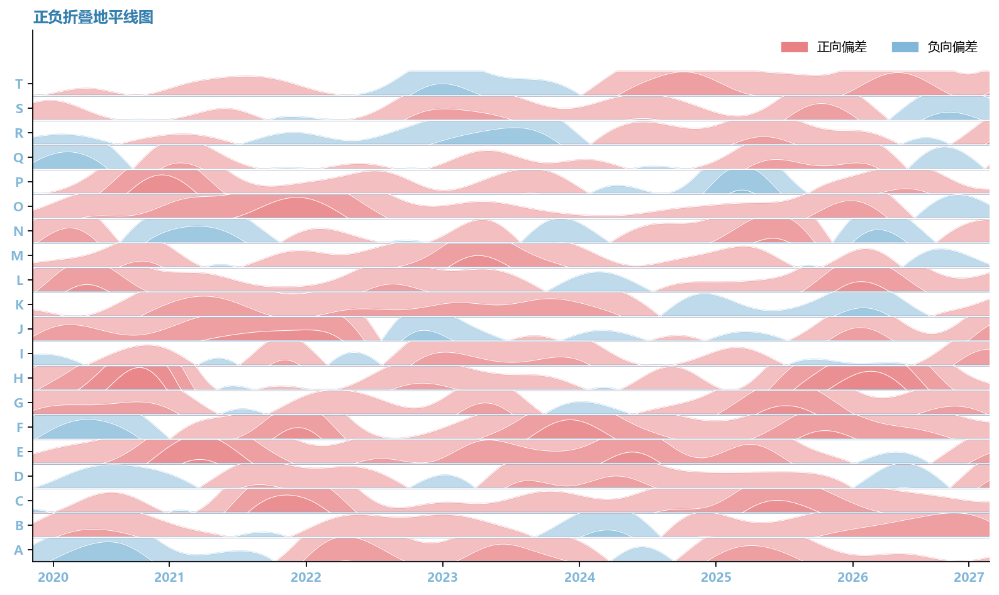

# 正负折叠地平线图

模板 129 · `screenshot.horizon`

标签：趋势、多序列、正负偏差

## 用途与数据

正负色彩、四层透明折叠、白边与多行偏移，用于同一 x 上多条有符号序列，统一折叠层宽的展示。

同一 x 上多条有符号序列，统一折叠层宽

## 结构与视觉特点

正负色彩、四层透明折叠、白边与多行偏移

## 适配和来源

代码截图恢复与适配。恢复全部可见绘图层与示例数据；调整导入、缩进、标签或输出边距以兼容当前运行环境。

[完整代码](../sources/screenshot.horizon/restored.py) · [来源说明](../sources/screenshot.horizon/SOURCE.md) · [参考截图](../sources/screenshot.horizon/reference.jpg)

## 源码保真要点

保留：正负色彩、四层透明折叠、白边与多行偏移；保留源码中对应的独立绘制层和视觉编码。

可适配：同一 x 上多条有符号序列，统一折叠层宽；可调整数据、标签、尺寸、视角及配色角色，但各色阶、透明度、轮廓和图例语义需对应。

- 源码定位：[sources/screenshot.horizon/restored.html#L41](../sources/screenshot.horizon/restored.html#L41)
- 源码定位：[sources/screenshot.horizon/restored.html#L42](../sources/screenshot.horizon/restored.html#L42)
