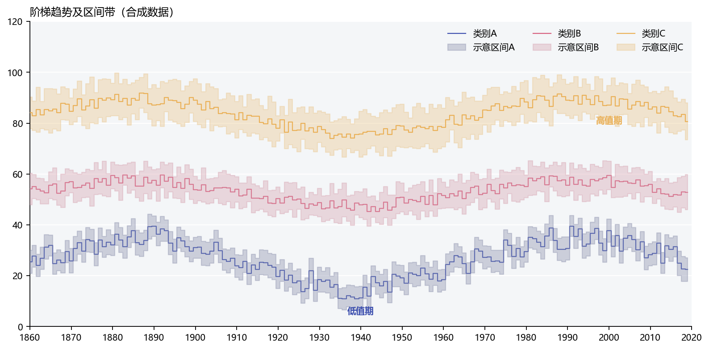

# 阶梯折线与区间带

模板 133 · `screenshot.interval_steps`

标签：趋势、误差、多序列

## 用途与数据

阶梯曲线、阶梯透明区间、双色层次和注释，用于x、各组估计值及上下界的展示。

x、各组估计值及上下界；真实区间必须来自计算

## 结构与视觉特点

阶梯曲线、阶梯透明区间、双色层次和注释

## 适配和来源

代码截图恢复与适配。原区间宽度随机生成，卡片与示例明确标为示意区间；真实置信区间必须由真实统计估计替换。

[完整代码](../sources/screenshot.interval_steps/restored.py) · [来源说明](../sources/screenshot.interval_steps/SOURCE.md) · [参考截图](../sources/screenshot.interval_steps/reference.jpg)

## 源码保真要点

保留：阶梯曲线、阶梯透明区间、双色层次和注释；保留源码中对应的独立绘制层和视觉编码。

可适配：x、各组估计值及上下界；真实区间必须来自计算；可调整数据、标签、尺寸、视角及配色角色，但各色阶、透明度、轮廓和图例语义需对应。

- 源码定位：[sources/screenshot.interval_steps/restored.html#L27](../sources/screenshot.interval_steps/restored.html#L27)
- 源码定位：[sources/screenshot.interval_steps/restored.html#L29](../sources/screenshot.interval_steps/restored.html#L29)
- 源码定位：[sources/screenshot.interval_steps/restored.html#L30](../sources/screenshot.interval_steps/restored.html#L30)
- 源码定位：[sources/screenshot.interval_steps/restored.html#L31](../sources/screenshot.interval_steps/restored.html#L31)
