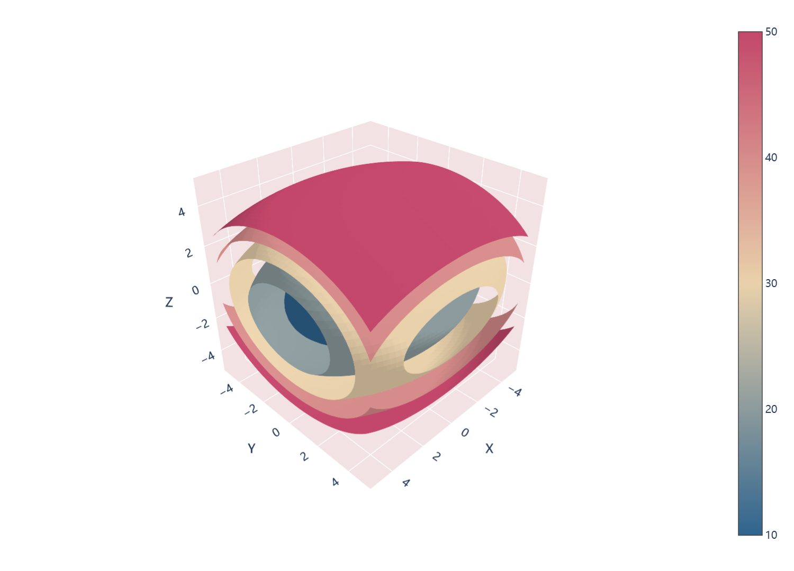

# 三维等值面

模板 117 · `screenshot.isosurface`

标签：三维、标量场

## 用途与数据

五层等值面、开口截面、连续色标与坐标壁，用于三维规则网格与每个网格点的标量的展示。

三维规则网格与每个网格点的标量

## 结构与视觉特点

五层等值面、开口截面、连续色标与坐标壁

## 适配和来源

代码截图恢复与适配。恢复全部可见绘图层与示例数据；调整导入、缩进、标签或输出边距以兼容当前运行环境。 使用Plotly交互显示；预览通过Kaleido导出，画布和边距适配截图检查。3D PDF内部仍含栅格渲染。

[完整代码](../sources/screenshot.isosurface/restored.py) · [来源说明](../sources/screenshot.isosurface/SOURCE.md) · [参考截图](../sources/screenshot.isosurface/reference.jpg)

## 源码保真要点

保留：五层等值面、开口截面、连续色标与坐标壁；保留源码中对应的独立绘制层和视觉编码。

可适配：三维规则网格与每个网格点的标量；可调整数据、标签、尺寸、视角及配色角色，但各色阶、透明度、轮廓和图例语义需对应。

- 源码定位：[sources/screenshot.isosurface/restored.html#L20](../sources/screenshot.isosurface/restored.html#L20)
