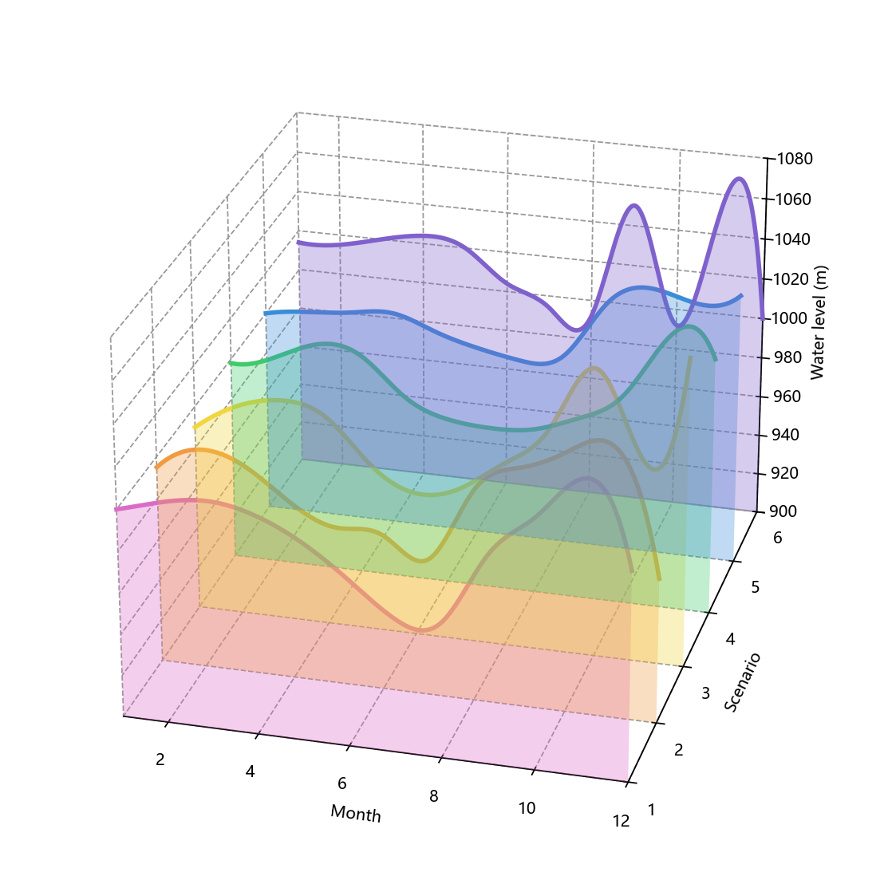

# 三维分层面积图

模板 111 · `screenshot.layered_area_3d`

标签：三维、趋势、分布

## 用途与数据

透明层叠面积、平滑曲线、三维轴与深色轮廓，用于有序 x 和多个情景数值序列的展示。

有序 x 和多个情景数值序列

## 结构与视觉特点

透明层叠面积、平滑曲线、三维轴与深色轮廓

## 适配和来源

部分代码恢复，缺失段按图补全。仅有007的CSV读取和函数起始页；保留可见读取函数，绘图部分按009效果图重建。 原CSV未附带，示例水位为手工合成；统一900m基座、六层透明填充与独立轮廓。

[完整代码](../sources/screenshot.layered_area_3d/restored.py) · [来源说明](../sources/screenshot.layered_area_3d/SOURCE.md) · [参考截图](../sources/screenshot.layered_area_3d/reference.jpg)

## 源码保真要点

保留：透明层叠面积、平滑曲线、三维轴与深色轮廓；保留源码中对应的独立绘制层和视觉编码。

可适配：有序 x 和多个情景数值序列；可调整数据、标签、尺寸、视角及配色角色，但各色阶、透明度、轮廓和图例语义需对应。

- 源码定位：[sources/screenshot.layered_area_3d/restored.html#L53](../sources/screenshot.layered_area_3d/restored.html#L53)
- 源码定位：[sources/screenshot.layered_area_3d/restored.html#L55](../sources/screenshot.layered_area_3d/restored.html#L55)
