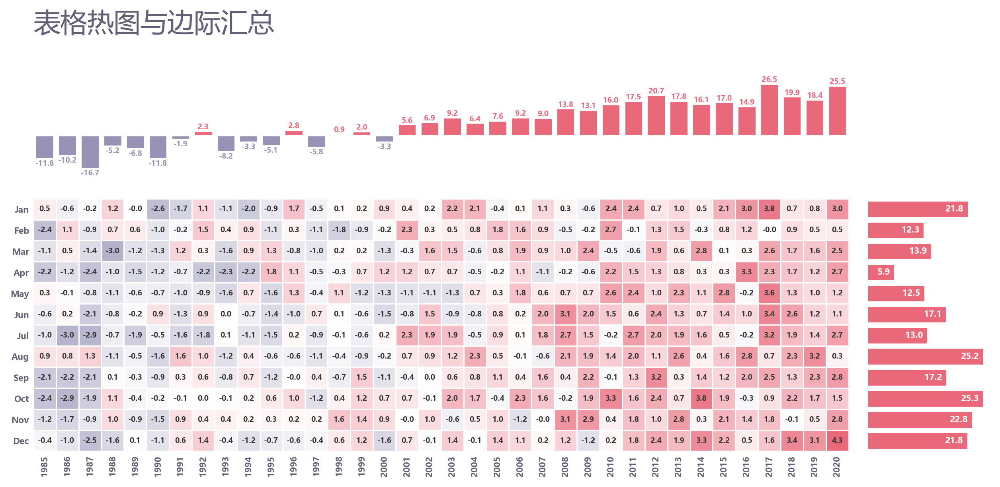

# 带边际柱形的表格热图

模板 132 · `screenshot.marginal_heatmap`

标签：矩阵、汇总、组合

## 用途与数据

热图文本、白格线、上方列和、右方行和及数值，用于有行列标签的数值矩阵，边际求和有意义的展示。

有行列标签的数值矩阵，边际求和有意义

## 结构与视觉特点

热图文本、白格线、上方列和、右方行和及数值

## 适配和来源

代码截图恢复与适配。恢复全部可见绘图层与示例数据；调整导入、缩进、标签或输出边距以兼容当前运行环境。

[完整代码](../sources/screenshot.marginal_heatmap/restored.py) · [来源说明](../sources/screenshot.marginal_heatmap/SOURCE.md) · [参考截图](../sources/screenshot.marginal_heatmap/reference.jpg)

## 源码保真要点

保留：热图文本、白格线、上方列和、右方行和及数值；保留源码中对应的独立绘制层和视觉编码。

可适配：有行列标签的数值矩阵，边际求和有意义；可调整数据、标签、尺寸、视角及配色角色，但各色阶、透明度、轮廓和图例语义需对应。

- 源码定位：[sources/screenshot.marginal_heatmap/restored.html#L30](../sources/screenshot.marginal_heatmap/restored.html#L30)
- 源码定位：[sources/screenshot.marginal_heatmap/restored.html#L34](../sources/screenshot.marginal_heatmap/restored.html#L34)
- 源码定位：[sources/screenshot.marginal_heatmap/restored.html#L35](../sources/screenshot.marginal_heatmap/restored.html#L35)
- 源码定位：[sources/screenshot.marginal_heatmap/restored.html#L40](../sources/screenshot.marginal_heatmap/restored.html#L40)
- 源码定位：[sources/screenshot.marginal_heatmap/restored.html#L44](../sources/screenshot.marginal_heatmap/restored.html#L44)

## 项目配色

热图默认读取项目配色；连续插值、中性色、透明度及数据归一化保留，数值文字按实际底色选择对比色。
