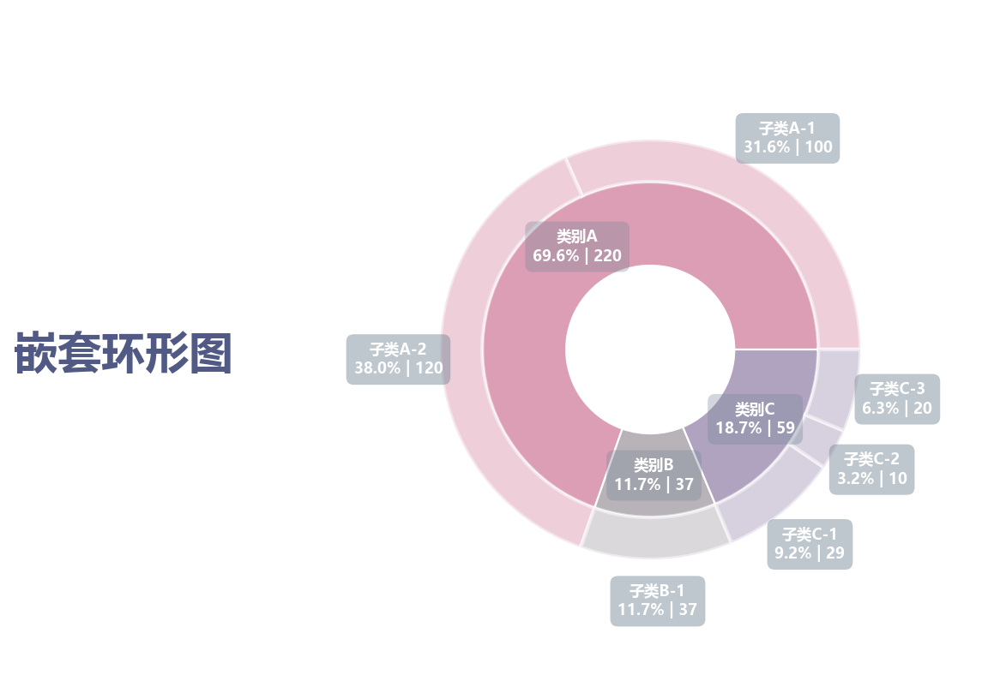

# 嵌套环形图

模板 127 · `screenshot.nested_donut`

标签：层级、组成、极坐标

## 用途与数据

内外两层圆环、外圈半透明、内外注释框，用于父类别和子类别的非负数值，父值等于子值之和的展示。

父类别和子类别的非负数值，父值等于子值之和

## 结构与视觉特点

内外两层圆环、外圈半透明、内外注释框

## 适配和来源

代码截图恢复与适配。恢复全部可见绘图层与示例数据；调整导入、缩进、标签或输出边距以兼容当前运行环境。

[完整代码](../sources/screenshot.nested_donut/restored.py) · [来源说明](../sources/screenshot.nested_donut/SOURCE.md) · [参考截图](../sources/screenshot.nested_donut/reference.jpg)

## 源码保真要点

保留：内外两层圆环、外圈半透明、内外注释框；保留源码中对应的独立绘制层和视觉编码。

可适配：父类别和子类别的非负数值，父值等于子值之和；可调整数据、标签、尺寸、视角及配色角色，但各色阶、透明度、轮廓和图例语义需对应。

- 源码定位：[sources/screenshot.nested_donut/restored.html#L28](../sources/screenshot.nested_donut/restored.html#L28)
- 源码定位：[sources/screenshot.nested_donut/restored.html#L38](../sources/screenshot.nested_donut/restored.html#L38)
