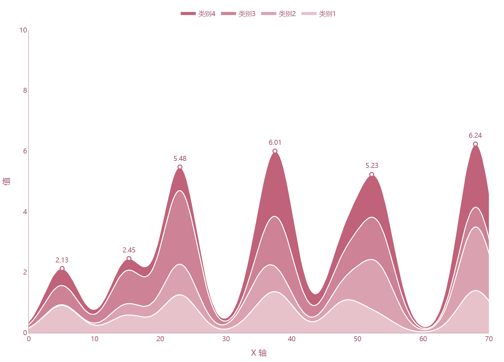

# 峰值标注堆叠面积图

模板 114 · `screenshot.peak_stacked_area`

标签：趋势、组成、注释

## 用途与数据

累计面积、白色边界、顶层峰值空心标记及数值，用于有序 x 和多条非负序列的展示。

有序 x 和多条非负序列

## 结构与视觉特点

累计面积、白色边界、顶层峰值空心标记及数值

## 适配和来源

代码截图恢复与适配。恢复多峰合成、累计面积、白边、空心峰值点和注释。 显式设定效果图的白色背景；演示图例移至上方。 使用Plotly交互显示；预览通过Kaleido导出，画布和边距适配截图检查。3D PDF内部仍含栅格渲染。

[完整代码](../sources/screenshot.peak_stacked_area/restored.py) · [来源说明](../sources/screenshot.peak_stacked_area/SOURCE.md) · [参考截图](../sources/screenshot.peak_stacked_area/reference.jpg)

## 源码保真要点

保留：累计面积、白色边界、顶层峰值空心标记及数值；保留源码中对应的独立绘制层和视觉编码。

可适配：有序 x 和多条非负序列；可调整数据、标签、尺寸、视角及配色角色，但各色阶、透明度、轮廓和图例语义需对应。

- 源码定位：[sources/screenshot.peak_stacked_area/restored.html#L44](../sources/screenshot.peak_stacked_area/restored.html#L44)
