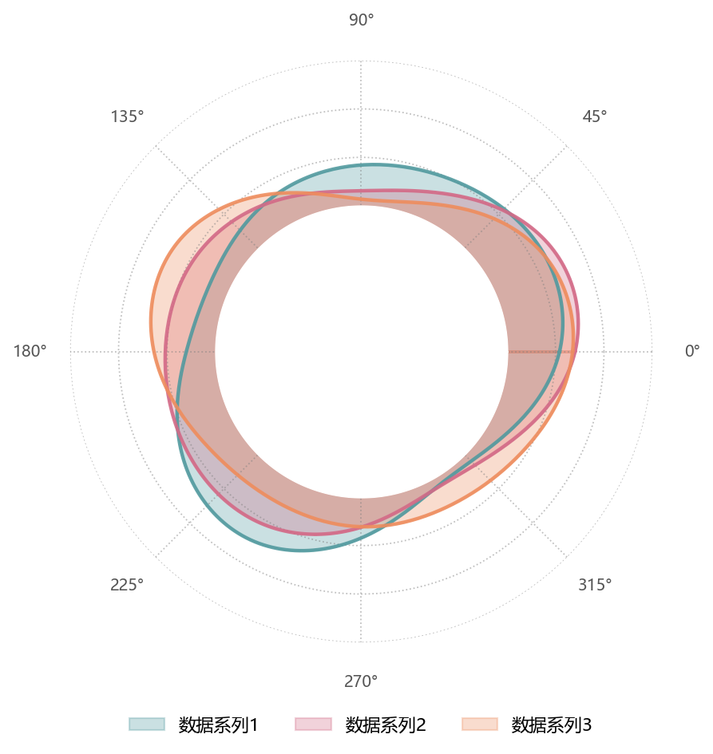

# 平滑极坐标面积叠加

模板 141 · `screenshot.polar_area`

标签：极坐标、周期、透明叠加

## 用途与数据

闭合平滑曲线、半透明重叠、深轮廓、空心基座和外置图例，用于angle（度）和多个 value 列的展示。

angle（度）和多个 value 列；角度严格递增且不重复360°

## 结构与视觉特点

闭合平滑曲线、半透明重叠、深轮廓、空心基座和外置图例

## 适配和来源

代码截图恢复，原数据缺失。原data.csv缺失，补充angle及三个value列的周期合成示例。 增加角度顺序及端点检查，周期样条在0/360处同时闭合值和斜率。 原中心Circle仅创建且使用私有变换；改为实际绘制的白色中心覆盖，保留空心基座。

[完整代码](../sources/screenshot.polar_area/restored.py) · [来源说明](../sources/screenshot.polar_area/SOURCE.md) · [参考截图](../sources/screenshot.polar_area/reference.jpg)

## 源码保真要点

保留：闭合平滑曲线、半透明重叠、深轮廓、空心基座和外置图例；保留源码中对应的独立绘制层和视觉编码。

可适配：angle（度）和多个 value 列；角度严格递增且不重复360°；可调整数据、标签、尺寸、视角及配色角色，但各色阶、透明度、轮廓和图例语义需对应。

- 源码定位：[sources/screenshot.polar_area/restored.html#L47](../sources/screenshot.polar_area/restored.html#L47)
- 源码定位：[sources/screenshot.polar_area/restored.html#L48](../sources/screenshot.polar_area/restored.html#L48)
