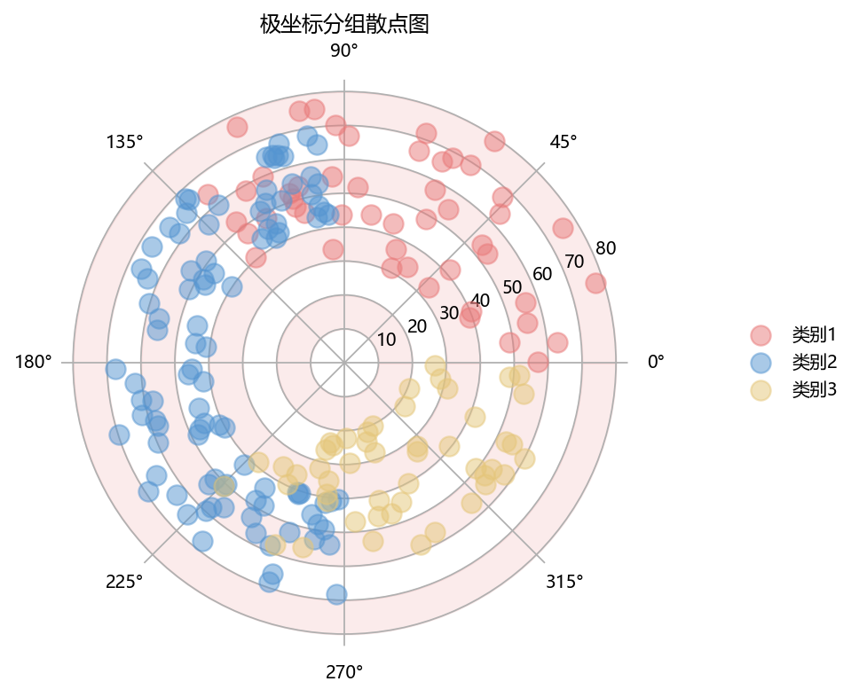

# 带背景圆环的极坐标散点

模板 139 · `screenshot.polar_scatter`

标签：极坐标、散点、比较

## 用途与数据

三组透明散点、交替浅色背景圆环、角度轴和图例，用于角度（弧度）和非负半径，以及分组的展示。

角度（弧度）和非负半径，以及分组

## 结构与视觉特点

三组透明散点、交替浅色背景圆环、角度轴和图例

## 适配和来源

代码截图恢复与适配。恢复全部可见绘图层与示例数据；调整导入、缩进、标签或输出边距以兼容当前运行环境。

[完整代码](../sources/screenshot.polar_scatter/restored.py) · [来源说明](../sources/screenshot.polar_scatter/SOURCE.md) · [参考截图](../sources/screenshot.polar_scatter/reference.jpg)

## 源码保真要点

保留：三组透明散点、交替浅色背景圆环、角度轴和图例；保留源码中对应的独立绘制层和视觉编码。

可适配：角度（弧度）和非负半径，以及分组；可调整数据、标签、尺寸、视角及配色角色，但各色阶、透明度、轮廓和图例语义需对应。

- 源码定位：[sources/screenshot.polar_scatter/restored.html#L24](../sources/screenshot.polar_scatter/restored.html#L24)
- 源码定位：[sources/screenshot.polar_scatter/restored.html#L27](../sources/screenshot.polar_scatter/restored.html#L27)
