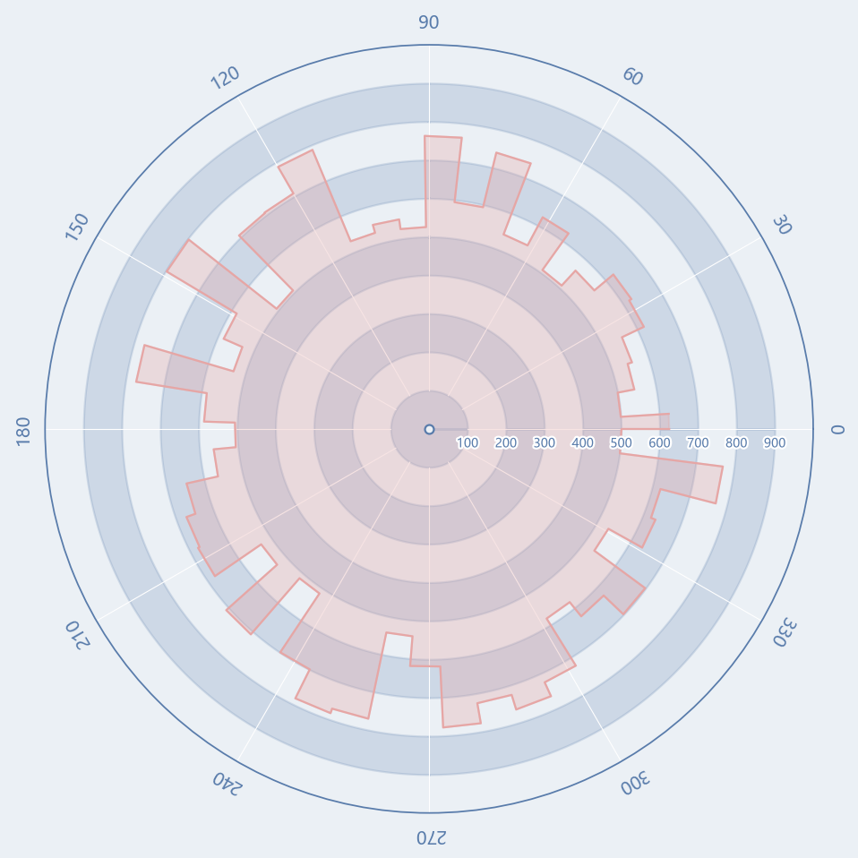

# 环形刻度阶梯面积图

模板 140 · `screenshot.polar_step_area`

标签：极坐标、趋势、阶梯

## 用途与数据

交替背景环、角度射线、描边径向刻度、阶梯填充与轮廓，用于按角度有序的非负半径的展示。

按角度有序的非负半径；源码为随机阶梯面积，不是真正频数直方图

## 结构与视觉特点

交替背景环、角度射线、描边径向刻度、阶梯填充与轮廓

## 适配和来源

代码截图恢复与适配。原标题称直方图，但代码绘制随机半径阶梯面积；按真实编码命名，不当作频数图。

[完整代码](../sources/screenshot.polar_step_area/restored.py) · [来源说明](../sources/screenshot.polar_step_area/SOURCE.md) · [参考截图](../sources/screenshot.polar_step_area/reference.jpg)

## 源码保真要点

保留：交替背景环、角度射线、描边径向刻度、阶梯填充与轮廓；保留源码中对应的独立绘制层和视觉编码。

可适配：按角度有序的非负半径；源码为随机阶梯面积，不是真正频数直方图；可调整数据、标签、尺寸、视角及配色角色，但各色阶、透明度、轮廓和图例语义需对应。

- 源码定位：[sources/screenshot.polar_step_area/restored.html#L25](../sources/screenshot.polar_step_area/restored.html#L25)
- 源码定位：[sources/screenshot.polar_step_area/restored.html#L26](../sources/screenshot.polar_step_area/restored.html#L26)
- 源码定位：[sources/screenshot.polar_step_area/restored.html#L37](../sources/screenshot.polar_step_area/restored.html#L37)
- 源码定位：[sources/screenshot.polar_step_area/restored.html#L38](../sources/screenshot.polar_step_area/restored.html#L38)
- 源码定位：[sources/screenshot.polar_step_area/restored.html#L44](../sources/screenshot.polar_step_area/restored.html#L44)
