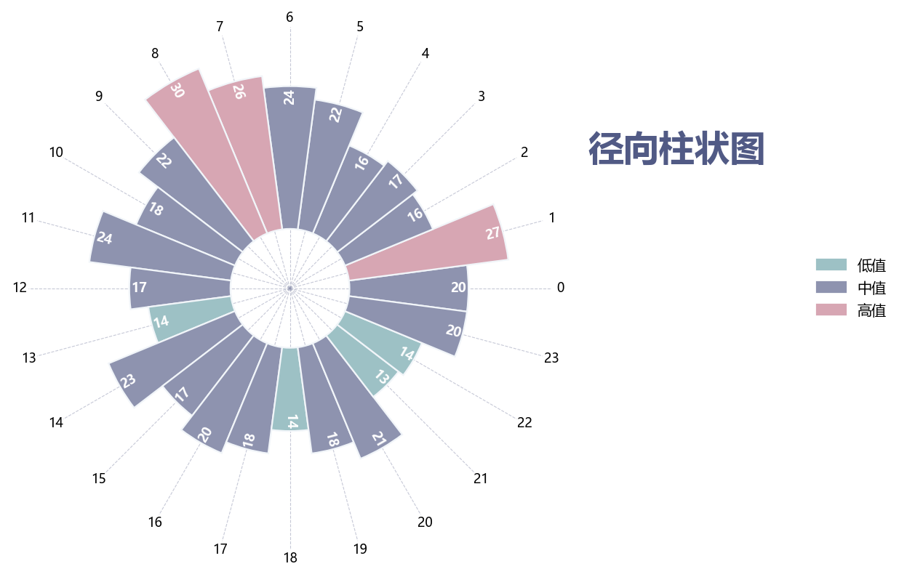

# 极坐标径向柱状图

模板 130 · `screenshot.radial_bars`

标签：比较、极坐标

## 用途与数据

径向条形、空心基座、三档颜色、旋转数值，用于非负类别值的展示。

非负类别值；类别角度等分

## 结构与视觉特点

径向条形、空心基座、三档颜色、旋转数值

## 适配和来源

代码截图恢复与适配。设置半径下界0，保留bottom=10的空心基座。

[完整代码](../sources/screenshot.radial_bars/restored.py) · [来源说明](../sources/screenshot.radial_bars/SOURCE.md) · [参考截图](../sources/screenshot.radial_bars/reference.jpg)

## 源码保真要点

保留：径向条形、空心基座、三档颜色、旋转数值；保留源码中对应的独立绘制层和视觉编码。

可适配：非负类别值；类别角度等分；可调整数据、标签、尺寸、视角及配色角色，但各色阶、透明度、轮廓和图例语义需对应。

- 源码定位：[sources/screenshot.radial_bars/restored.html#L22](../sources/screenshot.radial_bars/restored.html#L22)
- 源码定位：[sources/screenshot.radial_bars/restored.html#L25](../sources/screenshot.radial_bars/restored.html#L25)
