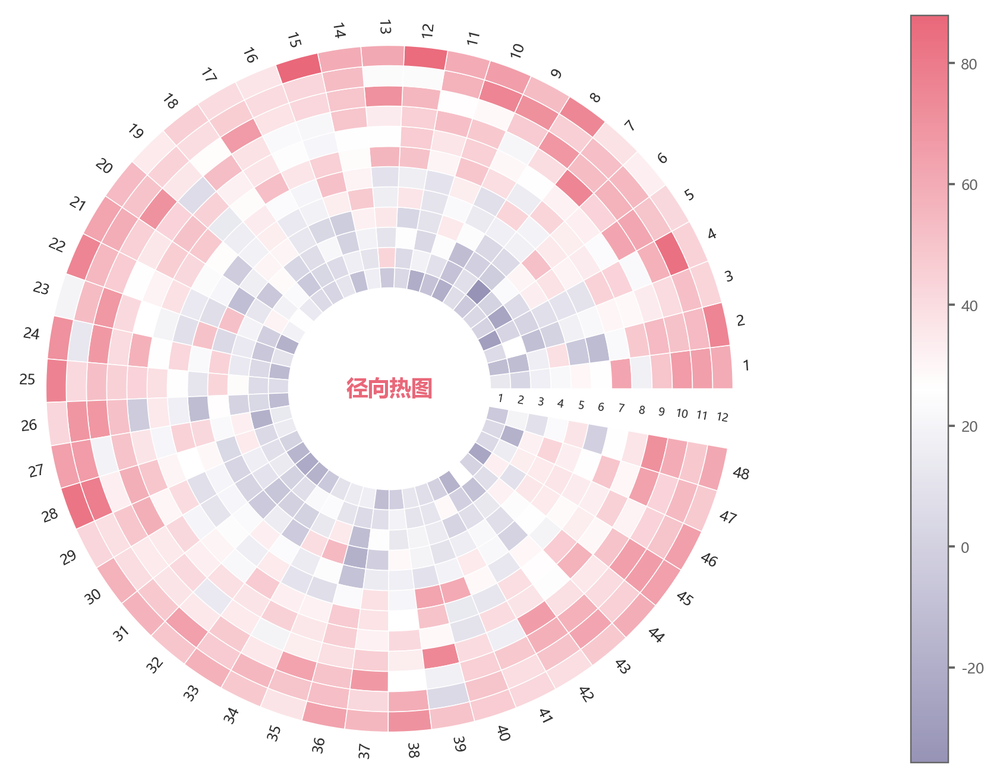

# 径向环形热图

模板 136 · `screenshot.radial_heatmap`

标签：矩阵、极坐标

## 用途与数据

分层环形单元、白边、缺口行标签、外圈列标签与色标，用于有行列标签的二维数值矩阵的展示。

有行列标签的二维数值矩阵

## 结构与视觉特点

分层环形单元、白边、缺口行标签、外圈列标签与色标

## 适配和来源

代码截图恢复与适配。显式align=edge统一环形单元角度边界与缺口；设置半径下界0保留中心空白。

[完整代码](../sources/screenshot.radial_heatmap/restored.py) · [来源说明](../sources/screenshot.radial_heatmap/SOURCE.md) · [参考截图](../sources/screenshot.radial_heatmap/reference.jpg)

## 源码保真要点

保留：分层环形单元、白边、缺口行标签、外圈列标签与色标；保留源码中对应的独立绘制层和视觉编码。

可适配：有行列标签的二维数值矩阵；可调整数据、标签、尺寸、视角及配色角色，但各色阶、透明度、轮廓和图例语义需对应。

- 源码定位：[sources/screenshot.radial_heatmap/restored.html#L30](../sources/screenshot.radial_heatmap/restored.html#L30)
- 源码定位：[sources/screenshot.radial_heatmap/restored.html#L31](../sources/screenshot.radial_heatmap/restored.html#L31)
- 源码定位：[sources/screenshot.radial_heatmap/restored.html#L36](../sources/screenshot.radial_heatmap/restored.html#L36)

## 项目配色

热图默认读取项目配色；连续插值、中性色、透明度及数据归一化保留，数值文字按实际底色选择对比色。
