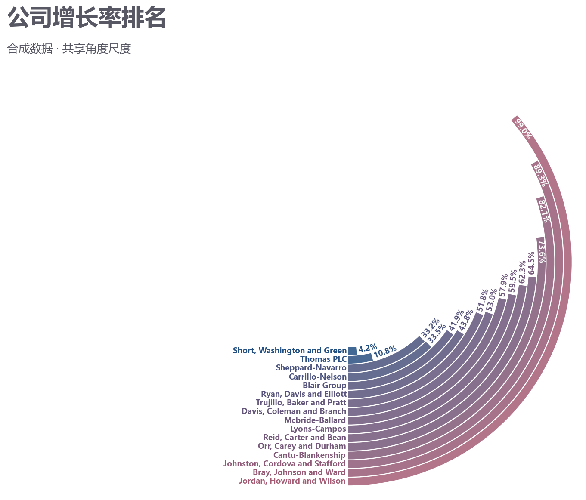

# 排名圆弧条形图

模板 128 · `screenshot.ranked_arcs`

标签：排序、比较、极坐标

## 用途与数据

按值排序圆弧、连续色阶、起点名称和端点值，用于类别及可排序的非负百分比的展示。

类别及可排序的非负百分比

## 结构与视觉特点

按值排序圆弧、连续色阶、起点名称和端点值

## 适配和来源

代码截图恢复与适配。保留Faker公司名、共享角度尺度和渐变圆弧；适度扩大画布与文字布局。

[完整代码](../sources/screenshot.ranked_arcs/restored.py) · [来源说明](../sources/screenshot.ranked_arcs/SOURCE.md) · [参考截图](../sources/screenshot.ranked_arcs/reference.jpg)

## 源码保真要点

保留：按值排序圆弧、连续色阶、起点名称和端点值；保留源码中对应的独立绘制层和视觉编码。

可适配：类别及可排序的非负百分比；可调整数据、标签、尺寸、视角及配色角色，但各色阶、透明度、轮廓和图例语义需对应。

- 源码定位：[sources/screenshot.ranked_arcs/restored.html#L33](../sources/screenshot.ranked_arcs/restored.html#L33)
- 源码定位：[sources/screenshot.ranked_arcs/restored.html#L35](../sources/screenshot.ranked_arcs/restored.html#L35)
