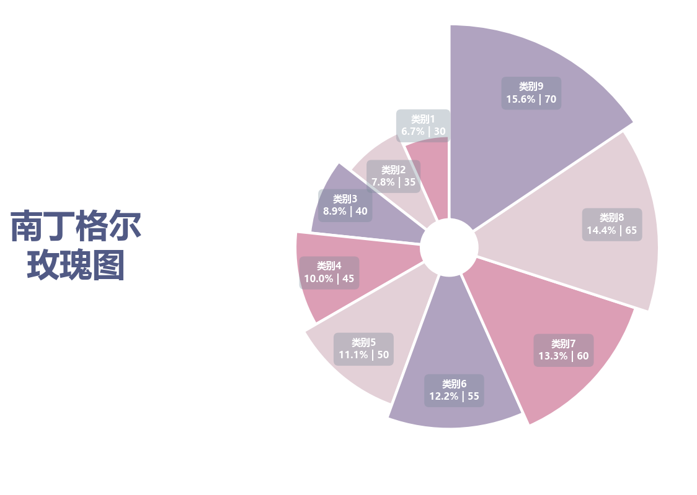

# 南丁格尔玫瑰图

模板 126 · `screenshot.rose`

标签：比较、极坐标

## 用途与数据

变角宽扇柱、中心留白、白色分隔和标签框，用于正值类别表的展示。

正值类别表；角宽与半径都编码值，不按面积读比例

## 结构与视觉特点

变角宽扇柱、中心留白、白色分隔和标签框

## 适配和来源

代码截图恢复与适配。原百分比公式width/pi*100会合计200%；改为value/sum(values)*100。 设置半径下界0以显示源码bottom=10的中心留白，微调前两个标签位置避免碰撞。

[完整代码](../sources/screenshot.rose/restored.py) · [来源说明](../sources/screenshot.rose/SOURCE.md) · [参考截图](../sources/screenshot.rose/reference.jpg)

## 源码保真要点

保留：变角宽扇柱、中心留白、白色分隔和标签框；保留源码中对应的独立绘制层和视觉编码。

可适配：正值类别表；角宽与半径都编码值，不按面积读比例；可调整数据、标签、尺寸、视角及配色角色，但各色阶、透明度、轮廓和图例语义需对应。

- 源码定位：[sources/screenshot.rose/restored.html#L25](../sources/screenshot.rose/restored.html#L25)
- 源码定位：[sources/screenshot.rose/restored.html#L29](../sources/screenshot.rose/restored.html#L29)
