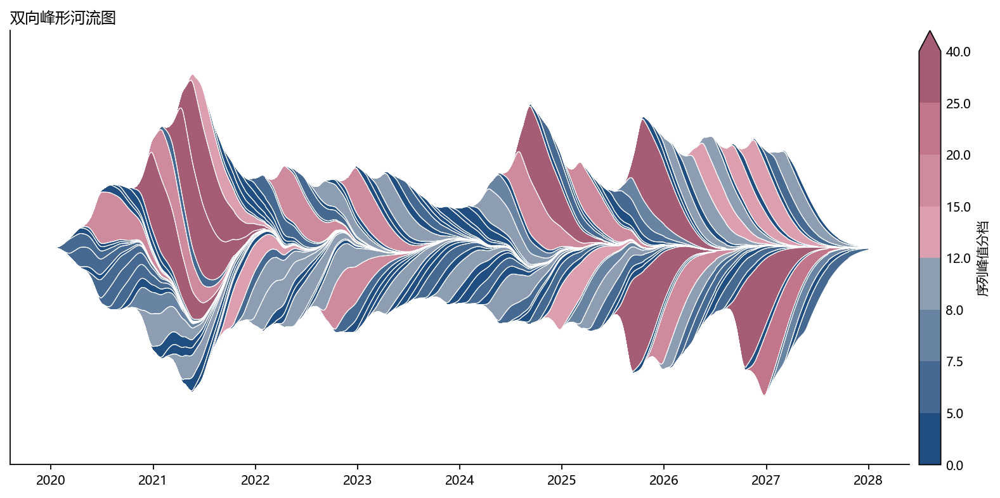

# 双向峰形河流图

模板 134 · `screenshot.streamgraph`

标签：趋势、流量、多序列

## 用途与数据

wiggle 基线、144条峰形带、白色边界和分档颜色，用于同一 x 上的非负序列的展示。

同一 x 上的非负序列

## 结构与视觉特点

wiggle 基线、144条峰形带、白色边界和分档颜色

## 适配和来源

代码截图恢复与适配。合并008（第一代码页）与088–090，恢复144条双向峰形和wiggle基线。 原颜色按峰值分档但色条为连续映射；色条改为同一组阈值和颜色，使图例与实际颜色一致。

[完整代码](../sources/screenshot.streamgraph/restored.py) · [来源说明](../sources/screenshot.streamgraph/SOURCE.md) · [参考截图](../sources/screenshot.streamgraph/reference.jpg)

## 源码保真要点

保留：wiggle 基线、144条峰形带、白色边界和分档颜色；保留源码中对应的独立绘制层和视觉编码。

可适配：同一 x 上的非负序列；可调整数据、标签、尺寸、视角及配色角色，但各色阶、透明度、轮廓和图例语义需对应。

- 源码定位：[sources/screenshot.streamgraph/restored.html#L43](../sources/screenshot.streamgraph/restored.html#L43)
- 源码定位：[sources/screenshot.streamgraph/restored.html#L46](../sources/screenshot.streamgraph/restored.html#L46)
- 源码定位：[sources/screenshot.streamgraph/restored.html#L49](../sources/screenshot.streamgraph/restored.html#L49)
