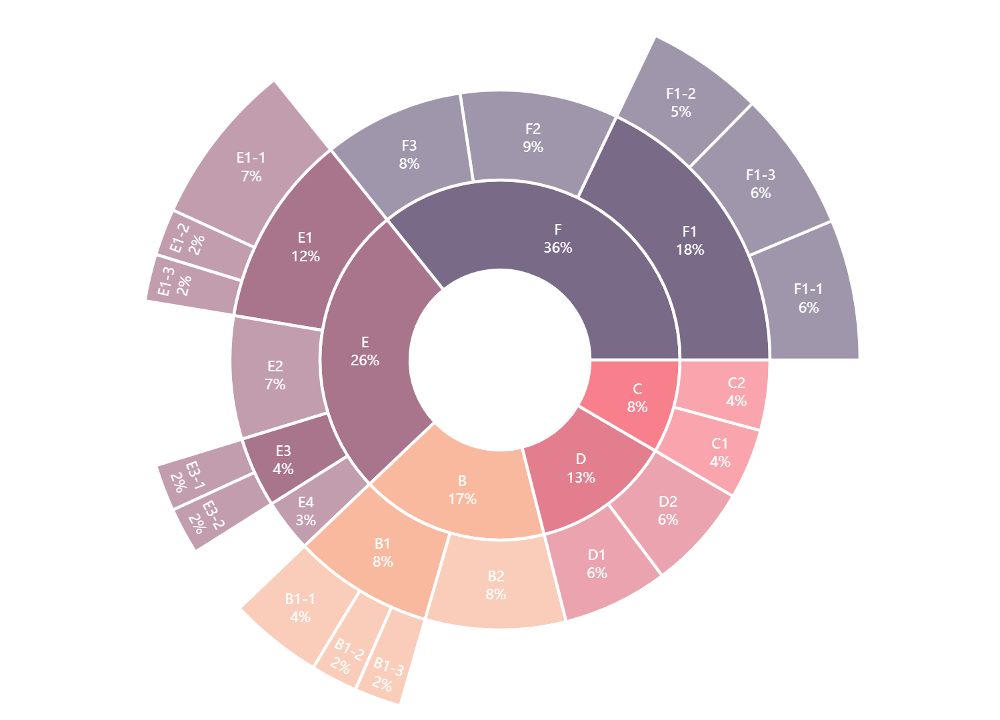

# 多层旭日图

模板 113 · `screenshot.sunburst`

标签：层级、组成、极坐标

## 用途与数据

多层扇区、白色分界、标签与根节点百分比，用于labels、parents、values 树形表的展示。

labels、parents、values 树形表；节点唯一且无环

## 结构与视觉特点

多层扇区、白色分界、标签与根节点百分比

## 适配和来源

代码截图恢复与适配。从012–013恢复树形演示数据和Plotly Sunburst；取消演示时向当前目录写出data.csv的副作用。 使用Plotly交互显示；预览通过Kaleido导出，画布和边距适配截图检查。3D PDF内部仍含栅格渲染。

[完整代码](../sources/screenshot.sunburst/restored.py) · [来源说明](../sources/screenshot.sunburst/SOURCE.md) · [参考截图](../sources/screenshot.sunburst/reference.jpg)

## 源码保真要点

保留：多层扇区、白色分界、标签与根节点百分比；保留源码中对应的独立绘制层和视觉编码。

可适配：labels、parents、values 树形表；节点唯一且无环；可调整数据、标签、尺寸、视角及配色角色，但各色阶、透明度、轮廓和图例语义需对应。

- 源码定位：[sources/screenshot.sunburst/restored.html#L26](../sources/screenshot.sunburst/restored.html#L26)
