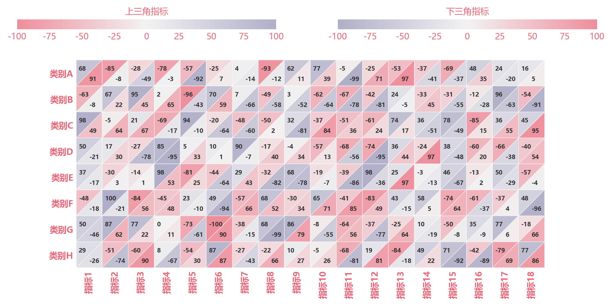

# 双指标三角热图

模板 115 · `screenshot.triangle_heatmap`

标签：矩阵、比较、双指标

## 用途与数据

每格双三角、独立色标、数值文本、透明填充和白边，用于形状及行列标签一致的两张矩阵的展示。

形状及行列标签一致的两张矩阵

## 结构与视觉特点

每格双三角、独立色标、数值文本、透明填充和白边

## 适配和来源

代码截图恢复与适配。恢复全部可见绘图层与示例数据；调整导入、缩进、标签或输出边距以兼容当前运行环境。

[完整代码](../sources/screenshot.triangle_heatmap/restored.py) · [来源说明](../sources/screenshot.triangle_heatmap/SOURCE.md) · [参考截图](../sources/screenshot.triangle_heatmap/reference.jpg)

## 源码保真要点

保留：每格双三角、独立色标、数值文本、透明填充和白边；保留源码中对应的独立绘制层和视觉编码。

可适配：形状及行列标签一致的两张矩阵；可调整数据、标签、尺寸、视角及配色角色，但各色阶、透明度、轮廓和图例语义需对应。

- 源码定位：[sources/screenshot.triangle_heatmap/restored.html#L48](../sources/screenshot.triangle_heatmap/restored.html#L48)
- 源码定位：[sources/screenshot.triangle_heatmap/restored.html#L49](../sources/screenshot.triangle_heatmap/restored.html#L49)
- 源码定位：[sources/screenshot.triangle_heatmap/restored.html#L57](../sources/screenshot.triangle_heatmap/restored.html#L57)

## 项目配色

热图默认读取项目配色；连续插值、中性色、透明度及数据归一化保留，数值文字按实际底色选择对比色。
