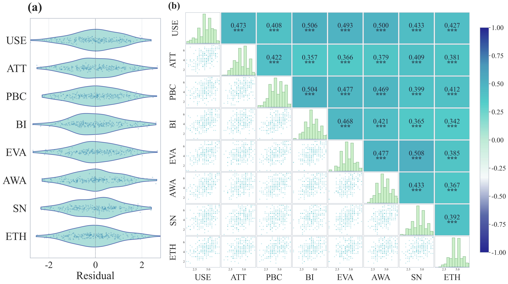

# 109 · 残差小提琴与Pearson完整组合

ID：`template.sem_violin_pearson`

用途：问卷构念的残差分布和两两关系如何并置展示？

标签：关联、分布、多维、组合

别名：violin Pearson、pairgrid、问卷构念、残差分布与相关关系、小提琴相关矩阵组合、左右组合

## 数据要求

- 逐受访者题项或构念分数
- 题项到构念映射
- 构念顺序

## 组合结构

左侧横向残差小提琴；右侧Pearson成对矩阵；外侧色条

## 视觉特点

- 统一青蓝透明琴体和散点
- 深轮廓
- 对角直方
- 上三角相关与星号
- 整体对齐

## 适配注意

原脚本直接复用；残差为各构念对其他构念OLS残差，非SEM路径残差；默认1–7量表及残差范围±2.8；色条两端同色。

## 预览

## 来源与核对

原名称：小提琴 + Pearson 完整组合模板
原始代码：[查看](../sources/template.sem_violin_pearson/original.html)
预览范围：完整组合输出
已查看对应预览并核对主要绘图和数据代码；卡片不是统计有效性认证。

## 相近候选

- [分布与Pearson成对关系矩阵](advanced.pair_plot.md)
- [相关显著性热图与顶部树](empirical.correlation_heatmap.md)
- [简洁下三角相关矩阵](competition.correlation_matrix.md)
- [带双侧树状图的下三角相关矩阵](basic.heatmap.md)

<!-- fidelity:start -->
## 源码保真要点

以当前完整配方源码为底稿；下列行号指向解释预览的快照。数据适配不应顺手删掉这些视觉结构。

### 完整组合的对齐和透明层

- 保留重点：保留左横向残差小提琴与散点的透明层、深轮廓，右侧对角直方/下三角散点/上三角相关的分工，以及整体拼合与外侧色条。直接以完整组合代码适配。
- 可适配：变量与样本数、列宽和输出尺寸可变，量表/残差定义与相关检验按模板专用说明适配；默认样式及换色遵循该组合的专用说明。
- 源码：[L208–219](../sources/template.sem_violin_pearson/original.html#L208) · [L222–222](../sources/template.sem_violin_pearson/original.html#L222) · [L226–226](../sources/template.sem_violin_pearson/original.html#L226) · [L257–257](../sources/template.sem_violin_pearson/original.html#L257) · [L267–267](../sources/template.sem_violin_pearson/original.html#L267) · [L272–272](../sources/template.sem_violin_pearson/original.html#L272) · [L298–298](../sources/template.sem_violin_pearson/original.html#L298)

按现有审图流程对照实际输出；有疑问时可用[源码差异提示](../../template-fidelity.md)。
