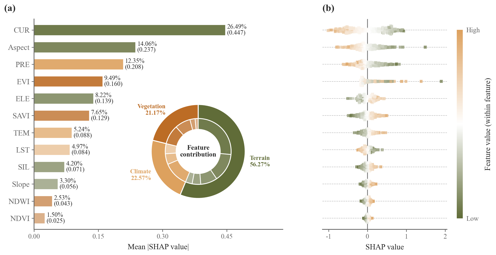

# 146 · SHAP排名双层贡献环与蜂群组合

ID：`template.shap_contribution`

标签：解释、机器学习、组成、排序、组合

## 用途与数据

单个变量及其所属类别的模型归因贡献分别有多大，影响方向如何分布？

- 按sample_id和变量名对应的特征表与SHAP表
- 覆盖全部变量的2–6组分类映射

## 组合结构

左侧重要性排名及百分比；空白处嵌双层变量/类别贡献环；右侧同序方形蜂群和连续色条

## 视觉特点

- 条形末端数值和全变量占比
- 组内色阶
- 内变量外类别双环
- 嵌入左侧空白区
- 与排名逐行对齐的方形蜂群

## 预览

## 适配与来源

用户仅提供效果图，未提供原始代码、模型或数据；按截图完整组合结构重建。演示为320个模拟样本、12个变量及含非线性和交互的合成模型，使用解析interventional SHAP，不是原研究结果。

连续颜色在每个变量内部按min/max归一化，重要性为平均绝对SHAP。模型归因不是因果效应。变量分组必须有实际含义；占比分母和环图均覆盖全部输入变量，top筛选不改变归一化。组贡献采用各变量mean(abs(SHAP))之和，不与有符号组归因混淆。

[当前调用说明](../../templates/shap-composites/TEMPLATE.md) · [来源和参考图](../sources/template.shap_contribution/SOURCE.md) · [源码快照](../sources/shap-composites/original.html)

## 源码保真要点

保留排名与右侧蜂群的同一变量顺序及行对齐、条末占比和原始重要性、左侧空白处双层环及白色分隔、组内色阶与方形透明散点。

变量分组必须有实际含义；占比分母和环图均覆盖全部输入变量，top筛选不改变归一化。组贡献采用各变量mean(abs(SHAP))之和，不与有符号组归因混淆。

[L272](../sources/shap-composites/original.html#L272) · [L300](../sources/shap-composites/original.html#L300) · [L304](../sources/shap-composites/original.html#L304) · [L321](../sources/shap-composites/original.html#L321) · [L325](../sources/shap-composites/original.html#L325)
