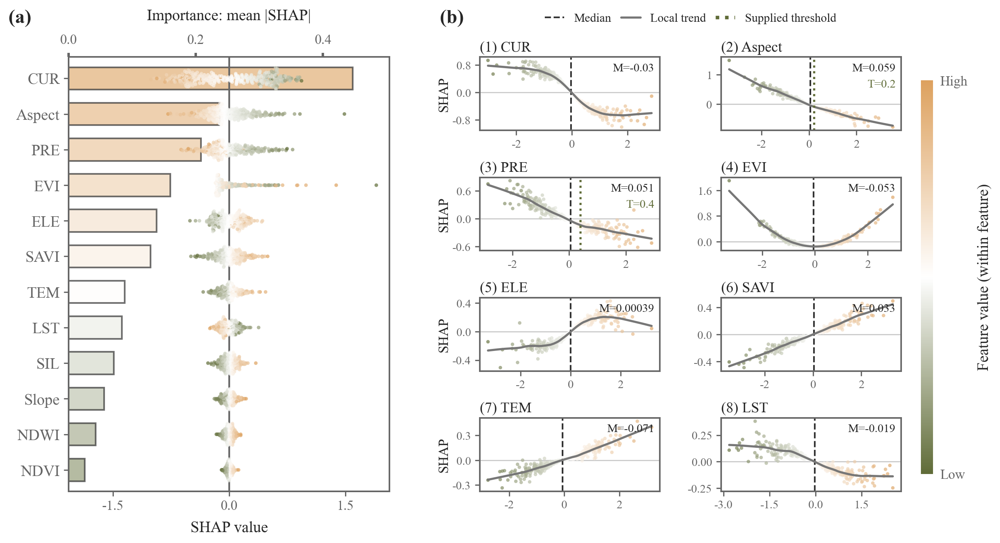

# 145 · SHAP重要性蜂群与依赖图组合

ID：`template.shap_dependence`

标签：解释、机器学习、分布、非线性、组合

## 用途与数据

哪些特征影响模型预测，它们的数值变化与SHAP归因有什么关系？

- 同一模型输出、同一批样本的数值特征表与SHAP表
- 唯一sample_id和变量名；可选带方法说明的阈值

## 组合结构

左侧双横轴重要性柱与蜂群叠加；右侧两列SHAP依赖图；共享特征值色条

## 视觉特点

- 双横轴条形蜂群叠加
- 透明圆点
- 重要性一致排序
- 两列依赖面板
- 局部趋势、中位数和可选阈值

## 预览

## 适配与来源

用户仅提供效果图，未提供原始代码、模型或数据；按截图完整组合结构重建。演示为320个模拟样本、12个变量及含非线性和交互的合成模型，使用解析interventional SHAP，不是原研究结果。

连续颜色在每个变量内部按min/max归一化，重要性为平均绝对SHAP。模型归因不是因果效应。可替换真实SHAP和特征、标签、top项数及面板数量；阈值须提供数值与来源，默认不推断转折点；性能指标不得照抄截图。

[当前调用说明](../../templates/shap-composites/TEMPLATE.md) · [来源和参考图](../sources/template.shap_dependence/SOURCE.md) · [源码快照](../sources/shap-composites/original.html)

## 源码保真要点

保留顶部重要性轴与底部有符号SHAP轴、同一变量行的柱/蜂群叠加、右侧两列依赖图及共享连续色条；散点横坐标不抖动，透明层与趋势线分明。

可替换真实SHAP和特征、标签、top项数及面板数量；阈值须提供数值与来源，默认不推断转折点；性能指标不得照抄截图。

[L194](../sources/shap-composites/original.html#L194) · [L198](../sources/shap-composites/original.html#L198) · [L206](../sources/shap-composites/original.html#L206) · [L216](../sources/shap-composites/original.html#L216) · [L220](../sources/shap-composites/original.html#L220) · [L232](../sources/shap-composites/original.html#L232)
